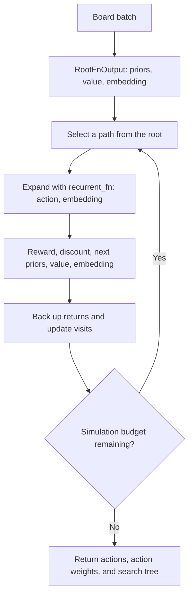

TL;DR: This tutorial turns a familiar tic-tac-toe game into the batched model
interface expected by Mctx. We use the same code on an NVIDIA GPU or a CPU
fallback, solve tactical positions, play complete games, and measure how
batching changes search throughput.

<!-- more -->

## What You'll Build

By the end of this tutorial you will have:

- A JAX-native model of tic-tac-toe transitions, wins, draws, and legal moves
- A batched `mctx.RootFnOutput` and recurrent model
- An Mctx player with exploration noise disabled for evaluation
- Outcome comparisons of Mctx and rollout MCTS against the same random opponent
- A synchronized benchmark that separates JIT compilation from search time
- One Docker image that uses an NVIDIA GPU when available and falls back to CPU

The [executable notebook](mctx_tic_tac_toe.ipynb) walks through the examples.
The [utility module](mctx_tic_tac_toe_utils.py) contains the adapter and search
helpers, and the [README](README.md) describes the Docker environment.

## What You'll Need

- Docker
- An NVIDIA GPU, compatible driver, and NVIDIA Container Toolkit for the
  accelerated path
- No GPU for the fallback path
- Basic Python and command-line familiarity; no prior JAX experience

From the repository root, build and start the tutorial:

```bash
cd research/Implement_MonteCarlo_Tree_Search_and_Alpha_Zero/mctx
./docker_build.sh
./docker_jupyter.sh
```

Open `mctx_tic_tac_toe.ipynb` in Jupyter and run its cells in order. The first
section prints the selected JAX backend and devices: `gpu` confirms GPU use,
while `cpu` confirms the fallback. Device selection defaults to `auto`.

## Why Mctx Is Different

The [parent tutorial](../main.ipynb) implements Monte Carlo tree search (MCTS)
directly with Python node objects. Each simulation selects a path, expands one
node, performs a random rollout, and backs the result up through the tree.
That version is intentionally easy to read and debug.

[Mctx](https://github.com/google-deepmind/mctx) targets a different setting. It
expresses search as JAX array operations that support just-in-time (JIT)
compilation and run on batches of positions in parallel. Instead of asking
for a mutable game object, it asks for two model components:

- A root containing policy logits (scores for actions), a position value
  (estimated return), and a state embedding (here, the board)
- A recurrent function that predicts the result of taking an action

Google DeepMind provides Mctx as a JAX-native implementation of search
algorithms for AlphaZero, MuZero, and Gumbel MuZero. Its
[official documentation](https://github.com/google-deepmind/mctx#motivation)
emphasizes configurable search, JIT compilation, and batching.
A handwritten Python tree is useful for inspecting individual simulations;
Mctx fits our goal of running many searches together with JAX models on a GPU.

The transition function need not be learned. Here, the tic-tac-toe rules
provide exact transitions. Uniform priors and zero nonterminal values let us
study search before adding a neural network. Zero values provide no heuristic
guidance about unfinished positions: useful outcome information arrives when
tree expansion reaches terminal rewards. That keeps this small example
tractable, but a limited search budget can still miss a tactic. Larger games
need informative policy and value estimates to use that budget effectively.

## What One Mctx Simulation Does

One simulation descends from the root using the search policy to select
actions. When it reaches an unvisited edge, it calls `recurrent_fn` to expand
that edge. The result contains a reward, discount, next-state priors and value,
and a new embedding. Mctx then backs the return up along the visited path and
updates its statistics. A configured depth limit can also end a traversal.



Our Python MCTS baseline evaluates a leaf by playing random moves to the end
of the game. Mctx instead accepts the recurrent function's value as the leaf
estimate; one simulation does not require a random rollout to termination.
See the [search implementation][mctx-search] for the traversal and backup code.

## Represent Every Position for the Player to Move

The original game stores X as `1` and O as `-1`. A batched recurrent function
is simpler if `1` always means "the player making the next move."

Before search, each board is multiplied by its current player. After an action,
the board is negated for the opponent. The same JAX code can therefore process
X and O positions together without branching on player identity.

Mctx backs up a return using reward plus discounted future value:

$$
G_t = r_{t+1} + d_{t+1} G_{t+1}.
$$

Our adapter encodes the player switch by returning `discount=-1` for
nonterminal moves. Since the next state's value belongs to the opponent,
subtracting it expresses the return from the current player's perspective.
Mctx consumes that discount; it does not infer the two-player game semantics.
A winning move returns reward `1`; a draw returns `0`. Both terminal
transitions use discount `0`, so no future value contributes to their result.

## Mask Illegal Actions

Mctx uses a fixed action dimension for every item in a batch. Tic-tac-toe has
nine possible actions even when only two cells remain empty.

For a nonterminal board, the adapter assigns a logit of `0` to every empty
cell and negative infinity to every occupied cell. At the root, we also pass
an explicit `invalid_actions` mask to Mctx, with `True` marking occupied cells.
For nodes expanded deeper in the tree, the recurrent function communicates
legality through its returned prior logits. It must recompute these after
each move so newly occupied cells cannot be selected during play.

Terminal nodes require special handling. An all-`-inf` vector produces NaNs
when normalized with softmax. Our adapter therefore returns finite dummy
logits for terminal boards and makes them absorbing: further search expansion
leaves the board unchanged and returns zero reward, discount, and value.
Those dummy actions are internal placeholders, not legal game moves. The
incoming terminal transition records the outcome once, and its zero discount
prevents later expansions from affecting that outcome. Terminal roots are
rejected before search begins.

## Search One Position

The tutorial first uses a position where X has an immediate win:

```text
X X .
O O .
. . .
```

`run_mctx_search()` wraps that state in a batch of size one and returns Mctx's
full policy output:

```python
import research.Implement_MonteCarlo_Tree_Search_and_Alpha_Zero.mctx.mctx_tic_tac_toe_utils as rimtsaazmmtttu

state = (1, 1, 0, -1, -1, 0, 0, 0, 0)
policy_output = rimtsaazmmtttu.run_mctx_search(
    [state], num_simulations=128, seed=0
)
print(policy_output.action)
print(policy_output.action_weights)
```

The selected action is cell `2`, completing the top row. The action weights,
visit probabilities, Q-values, and search tree show why that move is preferred.

The wrapper uses `gumbel_muzero_policy` with `gumbel_scale=0.0`, which disables
its root exploration noise for this evaluation. The
[policy API][mctx-policies] explicitly supports this setting for
perfect-information games. A fixed seed alone would only make a noisy search
reproducible; it would not disable exploration. The random opponent still
introduces randomness into complete games.

## Search a Batch on the GPU

A single tic-tac-toe position is too small to demonstrate why Mctx is designed
around JAX. The notebook therefore searches several distinct positions
together, then benchmarks batches of 1, 32, and 256 positions.

JAX dispatch is asynchronous, and the first call compiles the program. A fair
measurement must therefore:

1. Run one untimed warm-up for each shape.
2. Call `block_until_ready()` after every search.
3. Time multiple compiled executions.
4. Report the median and positions searched per second.

The notebook prints measurements for the machine running it. Timing includes
the public wrapper's board preparation and transfers as well as search. Small
batches may favor CPU because of launch overhead. Larger batches provide more
parallel work, but a GPU speedup is something to measure, not a guarantee.
Run the same benchmark with `MCTX_DEVICE=cpu` and `MCTX_DEVICE=gpu` to compare
backends, recording the device and simulation budget alongside each result.

## Play Complete Games

`make_mctx_player()` adapts the batch-oriented API back to the parent project's
`(game, state) -> move` interface. This lets us reuse its game loop and
evaluation code unchanged:

```python
import research.Implement_MonteCarlo_Tree_Search_and_Alpha_Zero.alphazero_utils as rimtsaazau

game = rimtsaazau.TicTacToe()
mctx_player = rimtsaazmmtttu.make_mctx_player(num_simulations=128, seed=0)
winner, history = rimtsaazau.play_game(
    game, mctx_player, rimtsaazau.random_player
)
```

The notebook evaluates Mctx against a random opponent and compares it with the
rollout-MCTS player. Equal simulation counts make the configuration easy to
read, but they are not identical units of work: the Python implementation uses
random rollouts, while this Mctx model expands a JAX search tree with uniform
priors and terminal rewards.

The random opponent is a smoke-test baseline for the integration. These small
samples do not establish which search method plays better. The notebook also
evaluates each agent as X, so a stronger evaluation would alternate sides and
include a perfect minimax opponent.

## GPU-First, CPU When Needed

The Mctx Docker image installs the modern `jax[cuda12]` plugin and its CUDA and
cuDNN user-space dependencies. The host supplies the NVIDIA driver and exposes
the device through Docker.

`MCTX_DEVICE=auto` selects the GPU when the NVIDIA Docker runtime is available.
If it is not, the launch scripts set `JAX_PLATFORMS=cpu`. You can also require a
GPU with `MCTX_DEVICE=gpu` or force the fallback with `MCTX_DEVICE=cpu`.

This keeps the accelerator path central to the tutorial without making GPU
ownership a prerequisite for learning the API.

## Key Takeaways

**Mctx accepts exact or learned models.** The root and recurrent interface
can use known game rules, as here, or a learned dynamics model, as in MuZero.

**Perspective matters.** Canonical boards plus a `-1` discount make two-player
value backup correct without separate X and O models.

**Masks preserve fixed shapes.** Nonterminal states retain all nine action
slots, with occupied cells masked. Terminal nodes use absorbing transitions.

**Compilation changes benchmarking.** Warm-up and synchronization are required
before CPU/GPU timing means anything.

**Batching is the real accelerator use case.** A single 3x3 board is an
educational example; many simultaneous positions demonstrate the architecture
Mctx was built for.

## What's Next

For an AlphaZero-style extension, keep the exact game transitions and replace
uniform priors and zero leaf values with learned policy and value heads.
Mctx's search-derived `action_weights` can supply policy targets during
self-play, alongside game outcomes for value training.

For a MuZero-style extension, also learn the dynamics: search operates on
latent embeddings through a learned transition and reward model. This is a
separate step from adding a policy/value network to known game rules.

Run the notebook on your own hardware, inspect the search tree, and then try
changing the batch size and simulation budget to see how throughput and move
selection respond.

## References

- [Mctx documentation and examples](https://github.com/google-deepmind/mctx)
- [mctx-policies]: https://github.com/google-deepmind/mctx/blob/main/mctx/_src/policies.py
- [mctx-search]: https://github.com/google-deepmind/mctx/blob/main/mctx/_src/search.py
