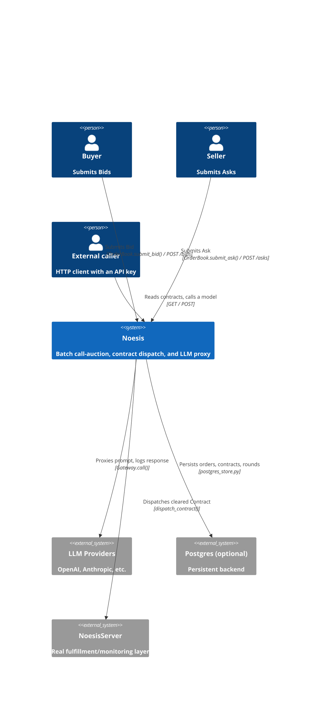
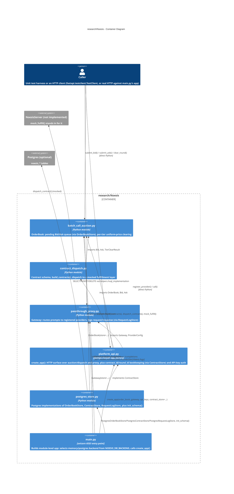

// > open_md.py -i research/Noesis/architecture.md

# Rules

- This document describe the code as it is, without making reference to intermediate
  PRs and how the code evolved
- It refers to:
  - The \Noesis{} protocol overview in `papers/Noesis/*.tex`
  - The implementation plan `research/Noesis/plan.Noesis.md`

# Overview

- `research/Noesis` contains:
  - `NoesisMarket`
  - `NoesisServer`
  - A thin HTTP surface over both (`NoesisPlatform` section)
  - A runnable deployment around that HTTP surface
- The HTTP surface
  - `batch_call_auction.py` and `contract_dispatch.py`: a call-auction that matches
    buyer/seller orders for LLM inference capacity and dispatches cleared contracts
    to a fulfillment layer
  - `passthrough_proxy.py`: a minimal LLM API gateway that routes prompts to
    registered providers and logs every request/response pair
  - `platform_api.py`: a `fastapi.FastAPI` app factory that wraps both of the above
    behind HTTP endpoints, so an external caller can reach them without importing the
    Python modules directly
  - `postgres_store.py`: Postgres-backed implementations of the storage interfaces
    the three modules above define, so their in-memory state can be swapped for a
    persistent backend
  - `main.py`: process entry point that builds a module-level `app`, wired to either
    the in-memory or the Postgres backend depending on env vars, meant to be run via
    `uvicorn research.Noesis.main:app`
  - `devops/`: Docker Compose deployment of `main.py`'s `app` plus a Postgres sidecar
    for local dev
- Problem solved: implements a two-sided market for LLM inference capacity
  (capability tier, latency, reliability, price), a mock fulfillment/dispatch layer
  for matched contracts, and a logging/proxy layer for LLM calls, reachable over HTTP
  by a caller outside the Python process, with an optional persistent (Postgres)
  backend and a containerized deployment path
- Key design decisions visible from the code:
  - Every stateful store (`OrderBook`'s pending orders, `platform_api`'s
    contract/round log, `Gateway`'s request log) sits behind a pluggable `abc.ABC`
    (`OrderBookStore`, `ContractStore`, `RequestLogStore`), each with an in-memory
    default and a `postgres_store.py` implementation
  - Every side effect that would be non-deterministic in a test (fulfillment outcome,
    provider network call, wall-clock time) is injected as a callable
    (`FulfillmentFunc`, `ProviderCallFunc`, `clock_func`, `rng`), so tests control it
    directly
  - Dataclasses encode the schema and validate every field with `hdbg.dassert_*` at
    construction time
  - `platform_api.py` adds no new validation logic: it reuses the same
    `hdbg.dassert_*` checks already in the three lower modules, catching the
    resulting `AssertionError` once at the app level and returning an HTTP 400
  - `main.py` selects the storage backend once, at import time, from
    `NOESIS_DB_BACKEND` (`"memory"` default or `"postgres"`); every other module is
    unaware which backend is active
- Who uses it: the unit test suites under `research/Noesis/test/`; an HTTP client
  wrapped in a `fastapi.testclient.TestClient` in tests, or a real HTTP client
  against `main.py`'s `app` when run via `uvicorn` or the
  `devops/docker_run/run_docker_noesis.sh` container

# Architecture (C4 Model)

## C1 (Context)

- Describes how the Noesis prototype fits with its (simulated) users and the external
  systems it integrates with, some of which are stubbed or optional
- The buyer/seller side is a test harness or an HTTP caller of
  `POST /bids`/`POST /asks`
- `External caller` is any HTTP client that reaches `NoesisMarket` and
  `NoesisServer`, gated by an `X-API-Key` header on the write endpoints
- `NoesisServer` is the real fulfillment layer described in `plan.Noesis.md`'s
  `NoesisServer` section; `contract_dispatch.mock_fulfill()` is its placeholder in
  this codebase
- `LLM Providers` are the real backends `passthrough_proxy.Gateway` calls through
  `ProviderConfig.call_func`; tests inject a stand-in `ProviderCallFunc` instead of a
  network call
- `Postgres` is entirely optional: `main.py` only connects to it, and
  `postgres_store.py` is only imported, when `NOESIS_DB_BACKEND=postgres`; the
  default `NOESIS_DB_BACKEND=memory` path never touches this system

## C2 (Container)

- Describes the six modules inside `research/Noesis` and the dependencies between
  them

- `contract_dispatch.py` is the only lower-layer module with an internal dependency
  on another lower-layer module: it imports `batch_call_auction` (`Bid`, `Ask`,
  `TierClearResult`) to build `Contract`s from a cleared round
- `passthrough_proxy.py` has no import relationship with `batch_call_auction.py`
  /`contract_dispatch.py`; it is a standalone container with no call path to or from
  the market side
- `platform_api.py` imports all three lower modules but adds no import between them:
  it is a fourth, higher container, not a rewire of the three existing ones (see the
  `## Weaknesses and Assumptions` entry on this)
- `postgres_store.py` is the only module that imports all three of
  `batch_call_auction.py`/`contract_dispatch.py`/`platform_api.py` (to subclass their
  `*Store` `abc.ABC`s and reference their dataclasses); none of those three import it
  back, so there is no import cycle and no transitive `psycopg2` dependency for a
  caller that never selects the Postgres backend
- `main.py` is the only module that imports `postgres_store.py`, and only inside its
  `NOESIS_DB_BACKEND == "postgres"` branch (a deferred import); it is the sole place
  that decides which storage backend every other module runs against for the life of
  the process

## C3 (Component)

- Describes the runtime call chain from order submission through logged fulfillment
  outcome, the primary multi-module flow in this codebase
- `OrderBook.submit_bid()`/`submit_ask()` and `clear_round()` no longer hold
  `List[Bid]`/`List[Ask]` state directly: they delegate to an injected
  `OrderBookStore` (`_InMemoryOrderBookStore` by default), so `clear_round()` fetches
  pending orders once via `store.get_bids()`/`get_asks()`, buckets them by `c_level`
  in Python, and calls `_match_orders_in_tier()` once per tier, then calls
  `store.clear()` unconditionally (matched orders and unmatched orders alike)
- `build_contracts()` looks up each `Fill`'s buyer in `bids` (by `buyer_id`) to pull
  `l_max`/`r_min` onto the resulting `Contract`, since a `Fill` only carries
  `n_tasks`/`c_level`/`price`
- `dispatch_contract()` mutates `contract.fulfilled` in place using whatever
  `fulfillment_func` is passed (`mock_fulfill()` by default), and returns the same
  object
- `platform_api._MarketState.clear_round()` is the orchestration point that ties the
  market side together for the HTTP API: it reads pending bids, calls
  `OrderBook.clear_round()`, mints one shared `round_id` via
  `ContractStore.next_round_id()`, builds and dispatches every contract for the
  round, persists each via `ContractStore.save_contract()`, then persists and returns
  one `RoundClearResponse` per tier via `ContractStore.save_round()`
- `passthrough_proxy.Gateway.call()` runs a parallel, currently disconnected flow:
  `call()` looks up the `ProviderConfig` for `provider_name`, times
  `provider_config.call_func(model, prompt)` with the injected `clock_func`, computes
  `cost` from `cost_per_char`, and persists a `RequestLogEntry` via the injected
  `RequestLogStore.append()`, queried later via `get_log()` / `query_log()`
- `main.py` runs once, at import time, before any request-handling flow above: it
  resolves `NOESIS_DB_BACKEND`, builds the concrete `OrderBook` / `Gateway` /
  `ContractStore` (each wired to the same store backend), and passes them to
  `platform_api.create_app()` to produce the module-level `app` object `uvicorn`
  serves

```mermaid
%%{init: {"themeVariables": {"fontSize": "18px"}, "flowchart": {"nodeSpacing": 45, "rankSpacing": 55}}}%%
flowchart LR
    submit_bid["OrderBook.submit_bid()"] --> store[("OrderBookStore<br/>(in-memory or Postgres)")]
    submit_ask["OrderBook.submit_ask()"] --> store
    store --> clear_round["OrderBook.clear_round()"]
    clear_round --> match["_match_orders_in_tier()<br/>(per c_level)"]
    match --> tier_result["TierClearResult<br/>(fills, clearing_price, unfilled)"]
    tier_result --> build["build_contracts(bids, tier_results)"]
    build --> contract["Contract<br/>(fulfilled=None)"]
    contract --> dispatch["dispatch_contract() /<br/>dispatch_contracts()"]
    dispatch --> fulfill["fulfillment_func<br/>(default: mock_fulfill())"]
    fulfill --> save["ContractStore.save_contract()<br/>(_MarketState.clear_round())"]
```

