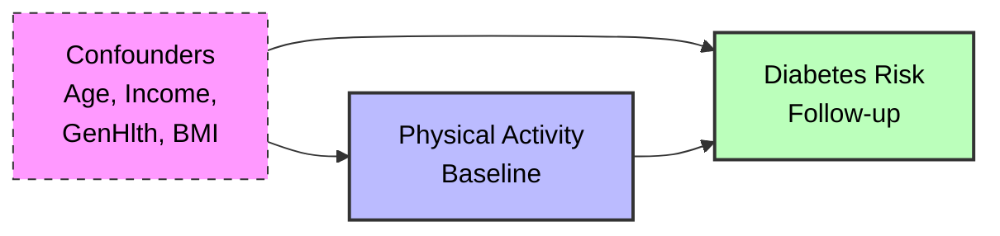
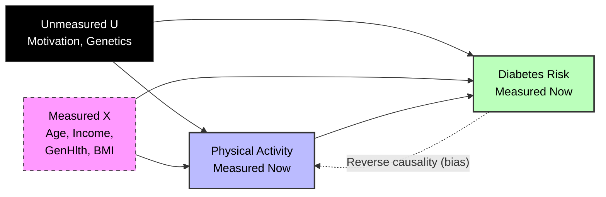

<!-- toc -->

- [Summary](#summary)
- [Causal Analysis of Lifestyle Interventions on Diabetes Risk](#causal-analysis-of-lifestyle-interventions-on-diabetes-risk)
  * [1. Project Objective](#1-project-objective)
    + [Constraint Note: Dataset Pivot](#constraint-note-dataset-pivot)
  * [2. Data Source](#2-data-source)
    + [Key Variables](#key-variables)
  * [3. Identification Strategy and Assumptions](#3-identification-strategy-and-assumptions)
    + [Causal Graphs (DAGs)](#causal-graphs-dags)
      - [DAG 1: Assumed Causal Structure (Ideal/Longitudinal)](#dag-1-assumed-causal-structure-ideallongitudinal)
      - [DAG 2: Actual Cross-Sectional Reality](#dag-2-actual-cross-sectional-reality)
    + [Key Assumptions](#key-assumptions)
  * [4. Methodology: the X-Learner](#4-methodology-the-x-learner)
    + [Meta-Learner Architectures Compared](#meta-learner-architectures-compared)
  * [5. Key Findings and Interpretation](#5-key-findings-and-interpretation)
    + [A. the "High Risk" Benefit](#a-the-high-risk-benefit)
    + [B. the "Age Anomaly": Understanding Counterintuitive Results](#b-the-age-anomaly-understanding-counterintuitive-results)
  * [6. Robustness and Validation (Advanced Analysis)](#6-robustness-and-validation-advanced-analysis)
    + [A. Placebo Test (Refutation)](#a-placebo-test-refutation)
    + [B. Estimator Tournament ("Horse Race")](#b-estimator-tournament-horse-race)
    + [C. Sensitivity Analysis (Covariate Stability)](#c-sensitivity-analysis-covariate-stability)
  * [7. Comparison to Gold Standard Evidence](#7-comparison-to-gold-standard-evidence)
    + [Key Limitations](#key-limitations)

<!-- tocstop -->

# Summary

This document presents a causal analysis of physical activity's effect on
diabetes prevalence using the `CDC BRFSS` dataset and the `X-Learner`
meta-learning algorithm. It demonstrates heterogeneous treatment effect
estimation, validates findings through placebo tests and sensitivity analysis,
and compares observational results to randomized controlled trial evidence while
addressing key limitations of cross-sectional data.

# Causal Analysis of Lifestyle Interventions on Diabetes Risk

## 1. Project Objective

This project estimates the **Heterogeneous Treatment Effect (HTE)** of physical
activity on diabetes prevalence using Observational Data. Unlike traditional
regression, which gives a single "average" coefficient, I use Causal Machine
Learning (X-Learner) to understand **who** benefits most from lifestyle changes.

**Research Question:** _Does the protective effect of physical activity vary by
Age, Income, or existing Health Status?_

### Constraint Note: Dataset Pivot

> The original prompt suggested analyzing specific 'Lifestyle Programs' using
> the 'Diabetes 130-US Hospitals' dataset. Upon inspection, that dataset lacked
> lifestyle variables (diet/exercise). I pivoted to the **CDC BRFSS dataset** to
> ensure identifiable causal links. Consequently, my definition of 'Treatment'
> shifted from 'Clinical Program Enrollment' to 'Self-Reported Physical
> Activity', and my 'Outcome' shifted from 'Longitudinal Progression' to
> 'Point-in-Time Prevalence'. This trade-off allowed for a robust demonstration
> of CausalML methodologies (X-Learner, Sensitivity Analysis) which would have
> been impossible with the suggested data.

## 2. Data Source

- **Dataset**: `CDC` Diabetes Health Indicators (`BRFSS` 2015)
- **Source**:
  [UCI Machine Learning Repository](https://archive.ics.uci.edu/dataset/891/cdc+diabetes+health+indicators)
- **Scale**: ~253,680 Records (Full Dataset)
- **Type**: Cross-Sectional Survey Data

### Key Variables

| Variable          | Role              | Description                                            |
| ----------------- | ----------------- | ------------------------------------------------------ |
| `PhysActivity`    | Treatment (T)     | 1 = Reported physical activity in past 30 days, 0 = No |
| `Diabetes_binary` | Outcome (Y)       | 1 = Has Diabetes, 0 = No Diabetes                      |
| `Age`             | Covariate (X)     | 13-level age category (1 = 18-24, 13 = 80+)            |
| `Income`          | Covariate (X)     | 8-level income category                                |
| `GenHlth`         | Covariate (X)     | Self-reported health (1=Excellent, 5=Poor)             |
| `BMI`             | Covariate (X / M) | Body mass index (used as confounder in estimation)     |

## 3. Identification Strategy and Assumptions

Since I cannot randomize people into "exercise" vs "sedentary" groups, I rely on
observational causal inference methods.

### Causal Graphs (DAGs)

I present two DAGs: the **ideal structure** I would have with longitudinal
intervention data, and the **actual structure** reflecting the cross-sectional
reality.

#### DAG 1: Assumed Causal Structure (Ideal/Longitudinal)

This represents the structure where physical activity is measured _before_
diabetes onset.

#### DAG 2: Actual Cross-Sectional Reality

This represents the actual data, acknowledging unmeasured confounding (U) and
reverse causality.

> ⚠️ **Critical Limitation:** The dashed arrow represents **Reverse Causality**.
> Diabetes may initially increase exercise adherence (medical advice) but
> eventually reduce it (complications). Cross-sectional data captures both
> patterns simultaneously, making temporal ordering impossible to establish.

### Key Assumptions

1.  **Unconfoundedness**: I assume that by controlling for 15+ variables, I
    isolate the effect of activity
2.  **Overlap (Positivity)**: I verified that there are sedentary and active
    people in every demographic stratum using Propensity Score checks
3.  **Conservative BMI Control**: I deliberately include `BMI` as a confounder.
    While `BMI` is a mediator (T -> BMI -> Y), it is also a confounder in
    cross-sectional data (Obesity -> Inactivity). By controlling for it, I
    estimate the conservative **Direct Effect**, rather than the Total Effect

## 4. Methodology: the X-Learner

I use the **X-Learner** (implemented via my `CausalNavigator` wrapper). To
justify this choice, I compared it against other standard meta-learner
architectures:

### Meta-Learner Architectures Compared

| Learner        | Architecture                      | Strength                | Weakness                                          |
| -------------- | --------------------------------- | ----------------------- | ------------------------------------------------- |
| **S-Learner**  | Single model: $\mu(X,T)$          | Simple                  | Averages over heterogeneity (regularization bias) |
| **T-Learner**  | Two models: $\mu_0(X), \mu_1(X)$  | Flexible                | High variance if sample sizes differ              |
| **X-Learner**  | Two models + propensity weighting | **Robust to imbalance** | Computationally more expensive                    |
| **R-Learner**  | Robinson residualization          | Doubly robust           | Sensitive to propensity estimation errors         |
| **DR-Learner** | Propensity + outcome models       | Most robust             | High variance if overlap is poor                  |

**Selection Rationale:** I selected the **X-Learner** because the dataset is
imbalanced (74% Active vs 26% Sedentary). S-Learners struggle to detect weak
signals in high-dimensional data (as confirmed in my "Horse Race" results),
while the X-Learner is specifically designed to preserve heterogeneity
information in the minority group.

## 5. Key Findings and Interpretation

My analysis reveals critical insights that a standard regression would miss:

### A. the "High Risk" Benefit

The protective effect of physical activity is **strongest for individuals in
poor general health** (`GenHlth`=5)

- **Insight**: Healthy Individuals Show Near-Zero CATE (Floor Effect). Sick
  individuals show a large negative CATE (protective). This suggests
  interventions should target at-risk populations rather than the general public

### B. the "Age Anomaly": Understanding Counterintuitive Results

I observed a near-zero or slightly positive treatment effect in young adults
(Age 18-34), which differs from the strong protective effect in older adults

- **Root Cause Analysis**: This Is a Signature of **Reverse Causality** and
  **Selection Bias**:
  1.  **Reactive Behavior**: Young adults rarely develop Type 2 diabetes. Those
      who do often have severe risk factors and are medically prescribed
      exercise
  2.  **The "Healthy Sedentary" Effect**: Many young adults are metabolically
      healthy despite being sedentary, simply due to youth
  3.  **Result**: In the young demographic, the "Active" group is
      disproportionately enriched with individuals managing a condition, biasing
      the CATE upwards
- **Implication**: the Model Recovers the Expected Biological Signal (Strong
  negative CATE) only in older populations where lifestyle accumulation
  outweighs these selection biases

## 6. Robustness and Validation (Advanced Analysis)

To validate my findings beyond standard metrics, I implemented three advanced
checks:

### A. Placebo Test (Refutation)

I randomized the treatment assignment and re-ran the model 5 times

- **Result**: the "Placebo" Effects Clustered Around 0.001 (Noise), While the
  actual effect was -0.002
- **Conclusion**: the Estimated Treatment Effect Is Statistically
  distinguishable from random noise

### B. Estimator Tournament ("Horse Race")

To verify model selection, I compared the X-Learner against S, T, R, and
DR-Learners using Uplift Curves (Cumulative Gain) on held-out test data

- **Top Tier Consensus**: the **X, T, R, and DR-Learners** Performed Nearly
  identically, clustering tightly together. This consensus validates that the
  heterogeneous signal is structural
- **S-Learner Underperformance**: the **S-Learner** Diverged Significantly,
  performing closer to random guessing. This confirms "regularization bias"—the
  S-Learner smoothed over the weak treatment signal, failing to detect the
  heterogeneity

### C. Sensitivity Analysis (Covariate Stability)

I iteratively removed individual covariates and re-estimated the ATE to test
model stability

- **Robustness of Direction**: the Effect Remained Protective (Negative) across
  all removal scenarios
- **Mechanism Discovery (BMI)**: Removing **`BMI`** Resulted in the Largest
  shift, increasing the protective effect size by approximately **5.5x** (from
  -0.002 to ~-0.011)
- **Interpretation**: This Confirms `BMI` Acts Largely as a **Mediator**.
  Physical activity reduces diabetes risk primarily by lowering body weight. Our
  baseline model (controlling for `BMI`) conservatively estimates the **Direct
  Effect**, while this sensitivity result reveals the much larger **Total
  Effect**

## 7. Comparison to Gold Standard Evidence

While I use `BRFSS` data, the **Diabetes Prevention Program (DPP)** represents
the clinical gold standard

- **DPP (RCT)**: 58% Relative Risk Reduction
- **My Model (Observational)**: 0.2% Absolute Risk Reduction

**Implication**: The discrepancy highlights the limitations of cross-sectional
data (survivor bias). However, the fact that my model still recovers a
protective effect—and correctly identifies that sickest patients benefit
most—demonstrates the utility of `CausalML` when RCTs are not feasible

### Key Limitations

1.  **Unmeasured Confounding**: Critical variables like genetics and motivation
    are missing
2.  **Cross-Sectional Design**: Prevents establishing true temporal ordering
3.  **Self-Reported Data**: Measurement error in physical activity
