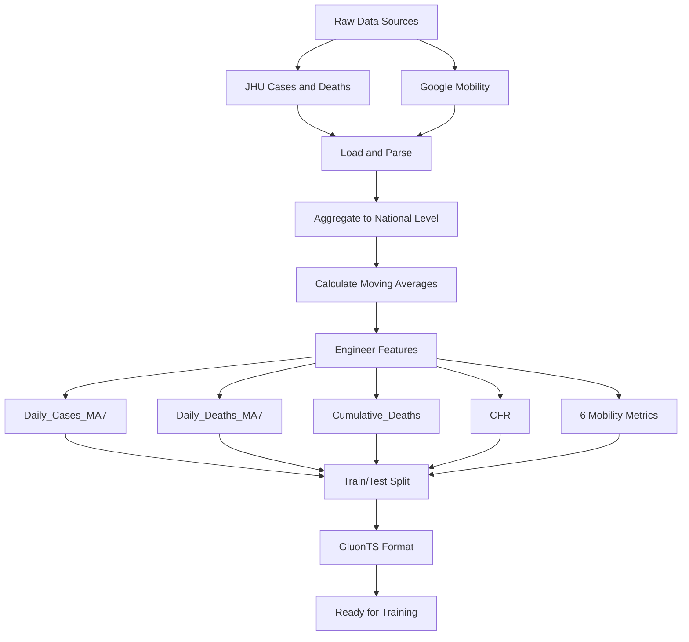

# GluonTS Probabilistic Time Series Forecasting

Welcome! This tutorial teaches you how to build probabilistic forecasting models with GluonTS. We use a **synthetic-data-first** approach: you'll learn GluonTS fundamentals with clean, interpretable synthetic data, then apply them to a real-world COVID-19 forecasting pipeline.

The tutorials are **interactive and focused on learning**. Implementation details live in reusable Python utilities so notebooks stay clean and readable—you focus on understanding *how* probabilistic forecasting works.

**What you'll learn:**
- Building time series forecasts with uncertainty estimates
- Comparing different GluonTS model architectures (DeepAR, SimpleFeedForward, DeepNPTS)
- Synthetic data progression: sinusoid → multi-frequency → regime change
- Real-world application: COVID-19 case forecasting with scenario analysis

# COVID-19 Case Prediction Using GluonTS

## Learning Path

1. **`GluonTS.API.ipynb`** — Start here. Learn GluonTS fundamentals with **synthetic data** (sinusoid, multi-frequency, regime change). No data download needed. Covers DeepAR, SimpleFeedForward, DeepNPTS.
2. **`GluonTS.example.ipynb`** — Real-world application. Full COVID-19 forecasting pipeline with JHU + mobility data, feature engineering, and scenario analysis.

## Getting Started

### Data Setup

**`GluonTS.API.ipynb`** uses synthetic data—no download needed. **`GluonTS.example.ipynb`** requires COVID data. Files are automatically downloaded when you run the example notebook. If automatic download fails, you can download them manually.

**Automatic Download (Default)**

Just run a notebook—it will:
1. Check if data exists locally
2. Download any missing files from Google Drive
3. Continue with analysis

No setup needed.

**Manual Download (If Blocked)**

Download from: https://drive.google.com/drive/folders/1qMDGBstdY8H2hYpz8xSolhzNOsVxNHMA

Save to `data/` directory:
- `cases.csv` — COVID-19 confirmed cases
- `deaths.csv` — COVID-19 deaths  
- `mobility.csv` — Mobility patterns

Or run:
```bash
python GluonTS_utils.py
```

### Build and Run

**Build Docker image:**
```bash
./docker_build.sh
```
Takes ~1-2 minutes the first time, ~30 seconds after.

**Start Jupyter:**
```bash
./docker_jupyter.sh
```
Opens at http://localhost:8888

**Or use interactive shell:**
```bash
./docker_bash.sh
```

### Files and Structure

**Notebooks**
- `GluonTS.API.ipynb` — GluonTS fundamentals with synthetic data
- `GluonTS.example.ipynb` — COVID-19 end-to-end application

**Utilities**
- `GluonTS_utils.py` — Consolidated utilities: data I/O, download, preprocessing,
  GluonTS conversion, model training, evaluation, visualization, synthetic data

**Data** (auto-downloaded)
- `data/cases.csv` — Daily confirmed cases
- `data/deaths.csv` — Daily deaths
- `data/mobility.csv` — Mobility patterns

**Documentation**
- `blog_GluonTS.md` — Blog post covering GluonTS and COVID-19 forecasting

**Docker**
- `Dockerfile` — Container setup
- `docker_build.sh` — Build image
- `docker_jupyter.sh` — Run Jupyter
- `docker_bash.sh` — Run shell
- `requirements.txt` — Python packages

## Notebook Design

The notebooks are organized for learning. Implementation details (data loading, plotting, model training) are in utility modules. Notebooks focus on the learning narrative—explanations, results, and insights.

Instead of notebook cells with 20 lines of matplotlib code, you see:
```python
import GluonTS_utils as gluonts
gluonts.plot_data_overview(train_df, test_df)
```

This keeps notebooks clean and readable.

### Model Comparison

| Model                 | External Features           | Training Time | Best Use Case                       |
| --------------------- | --------------------------- | ------------- | ----------------------------------- |
| **DeepAR**            | Yes (deaths, mobility, CFR) | 1 min       | Complex patterns, highest accuracy  |
| **SimpleFeedForward** | No                          | 30-40 sec     | Quick baselines, stable trends      |
| **DeepNPTS**          | Yes (deaths, mobility, CFR) | 15-20 sec       | Regime changes, distribution shifts |

## Data Pipeline



### Features Used

- **Target**: Daily COVID-19 cases (7-day moving average)
- **Deaths Features**: Daily deaths (MA7), cumulative deaths, CFR
- **Mobility Features**: Retail, grocery, parks, transit, workplaces,
  residential

**Metrics Explained**

- **MAE** = Average absolute difference (lower = better)
- **RMSE** = Penalizes large errors more (lower = better)
- **MAPE** = Percentage error, scale-independent (lower = better)
- **CRPS** = Probabilistic forecast quality (lower = better)

## Learning Resources

**GluonTS**  
- [Official Documentation](https://ts.gluon.ai/)
- [GitHub Repository](https://github.com/awslabs/gluonts)

**Research Papers**  
- [DeepAR: Probabilistic Forecasting with Autoregressive Recurrent Networks](https://arxiv.org/abs/1704.04110)
- [Deep Neural Probabilistic Time Series](https://arxiv.org/abs/1906.05264)

**Data Sources**  
- [JHU COVID-19 Data Repository](https://github.com/CSSEGISandData/COVID-19)
- [Google COVID-19 Community Mobility Reports](https://www.google.com/covid19/mobility/)
- [CDC COVID-19 Data Tracker](https://covid.cdc.gov/covid-data-tracker/)
