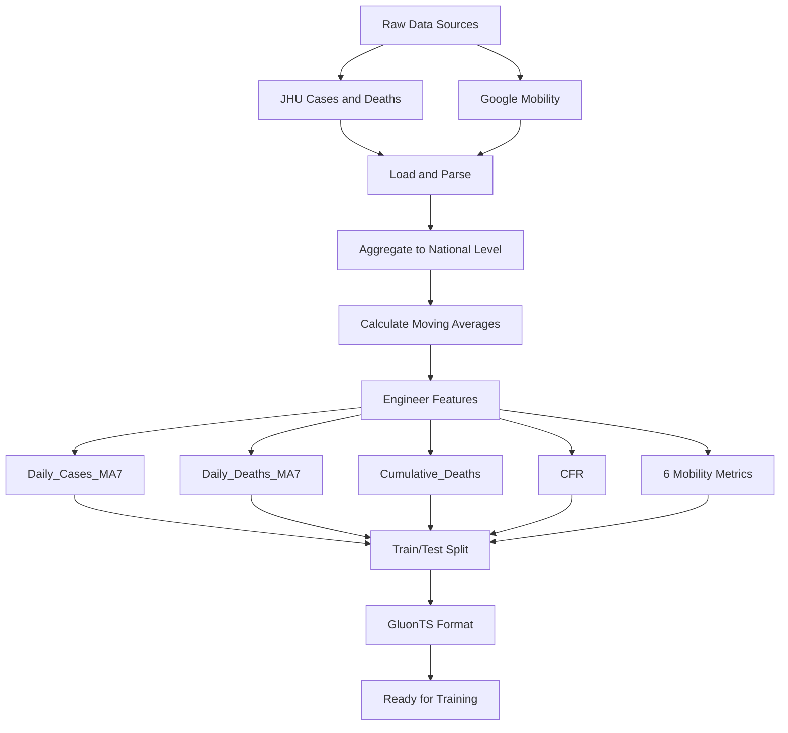

# COVID-19 Forecasting with GluonTS

Welcome! This tutorial shows you how to build a probabilistic forecasting system for predicting U.S. COVID-19 cases using GluonTS. You'll work through a complete, real-world pipeline: pulling data from multiple sources, engineering features that matter, training three different neural network models, and comparing their predictions.

The tutorials are designed to be **interactive and focused on learning**. While we cover all the practical details—data preprocessing, feature engineering, model training, and evaluation—the heavy lifting is handled by reusable Python utilities. This means the notebooks stay clean and readable, so you can actually focus on understanding *how* probabilistic forecasting works, rather than getting bogged down in implementation code.

**What you'll learn:**
- Building time series forecasts with uncertainty estimates
- Comparing different GluonTS model architectures
- Feature engineering for epidemiological data
- Evaluating probabilistic predictions

# COVID-19 Case Prediction Using GluonTS

## Getting Started

### Data Setup

Data files are automatically downloaded when you run the notebooks. If automatic download fails, you can download them manually.

**Automatic Download (Default)**

Just run a notebook—it will:
1. Check if data exists locally
2. Download any missing files from Google Drive
3. Continue with analysis

No setup needed.

**Manual Download (If Blocked)**

Download from: https://drive.google.com/drive/folders/1qMDGBstdY8H2hYpz8xSolhzNOsVxNHMA

Save to `data/` directory:
- `cases.csv` — COVID-19 confirmed cases
- `deaths.csv` — COVID-19 deaths  
- `mobility.csv` — Mobility patterns

Or run:
```bash
python utils_data_download.py
```

### Build and Run

**Build Docker image:**
```bash
./docker_build.sh
```
Takes ~1-2 minutes the first time, ~30 seconds after.

**Start Jupyter:**
```bash
./docker_jupyter.sh
```
Opens at http://localhost:8888

**Or use interactive shell:**
```bash
./docker_bash.sh
```

### Files and Structure

**Notebooks**
- `GluonTS.API.ipynb` — Model API demonstrations
- `GluonTS.example.ipynb` — Complete end-to-end example
- `GluonTS.example.md` — Guide (auto-synced with notebook)

**Utilities** 
- `utils_data_download.py` — Download data from Google Drive
- `utils_data_io.py` — Load case, death, and mobility data
- `utils_preprocessing.py` — Aggregate, merge, engineer features
- `utils_analysis.py` — Correlation analysis and data checks
- `utils_gluonts.py` — Convert to GluonTS format
- `utils_models.py` — Train DeepAR, SimpleFeedForward, DeepNPTS
- `utils_evaluation.py` — Calculate metrics
- `utils_visualization.py` — Plotting code
- `utils_notebook_loader.py` — Quick data loader

**Data** (auto-downloaded)
- `data/cases.csv` — Daily confirmed cases
- `data/deaths.csv` — Daily deaths
- `data/mobility.csv` — Mobility patterns

**Docker**
- `Dockerfile` — Container setup
- `docker_build.sh` — Build image
- `docker_jupyter.sh` — Run Jupyter
- `docker_bash.sh` — Run shell
- `requirements.txt` — Python packages

## Notebook Design

The notebooks are organized for learning. Implementation details (data loading, plotting, model training) are in utility modules. Notebooks focus on the learning narrative—explanations, results, and insights.

Instead of notebook cells with 20 lines of matplotlib code, you see:
```python
import utils_visualization as viz
viz.plot_data_overview(train_df, test_df)
```

This keeps notebooks clean and readable.

### Model Comparison

| Model                 | External Features           | Training Time | Best Use Case                       |
| --------------------- | --------------------------- | ------------- | ----------------------------------- |
| **DeepAR**            | Yes (deaths, mobility, CFR) | 3-4 min       | Complex patterns, highest accuracy  |
| **SimpleFeedForward** | No                          | 30-60 sec     | Quick baselines, stable trends      |
| **DeepNPTS**          | Yes (deaths, mobility, CFR) | 3-4 min       | Regime changes, distribution shifts |

## Data Pipeline



### Features Used

- **Target**: Daily COVID-19 cases (7-day moving average)
- **Deaths Features**: Daily deaths (MA7), cumulative deaths, CFR
- **Mobility Features**: Retail, grocery, parks, transit, workplaces,
  residential

**Metrics Explained**

- **MAE** = Average absolute difference (lower = better)
- **RMSE** = Penalizes large errors more (lower = better)
- **MAPE** = Percentage error, scale-independent (lower = better)
- **CRPS** = Probabilistic forecast quality (lower = better)

## Troubleshooting

**Port 8888 already in use?**

Another Jupyter is running. Either stop it or change the port. Edit `docker_jupyter.sh` line 14:
```bash
-p 8889:8888  # Use 8889 instead
```

**Docker build fails?**

Make sure Docker is actually running:
```bash
docker info
```

**"MPS not supported" warning on Mac?**

That's expected! The scripts automatically set `PYTORCH_ENABLE_MPS_FALLBACK=1` to use your CPU for unsupported operations. You'll see a warning during training—that's normal and won't slow you down.

**Out of memory?**

Your system is running too many things. Either reduce batch size in the notebook (`batch_size = 16`) or close other applications. Training will be slower but still work.

**Data files not found?**

Verify the data directory:
```bash
ls data/
# Should show: cases.csv, deaths.csv, mobility.csv
```

If it's empty, go back to the "Data Setup" section above and run the downloader.

## Quick Start Commands

```bash
# Download data (only needed if automatic download failed)
python utils_data_download.py

# Build Docker image
./docker_build.sh

# Start Jupyter Notebook
./docker_jupyter.sh

# Start interactive Python shell
./docker_bash.sh

# View running containers
docker ps

# Stop everything
# Press Ctrl+C in the terminal where Jupyter is running
```

## Learning Resources

**GluonTS**  
- [Official Documentation](https://ts.gluon.ai/)
- [GitHub Repository](https://github.com/awslabs/gluonts)

**Research Papers**  
- [DeepAR: Probabilistic Forecasting with Autoregressive Recurrent Networks](https://arxiv.org/abs/1704.04110)
- [Deep Neural Probabilistic Time Series](https://arxiv.org/abs/1906.05264)

**Data Sources**  
- [JHU COVID-19 Data Repository](https://github.com/CSSEGISandData/COVID-19)
- [Google COVID-19 Community Mobility Reports](https://www.google.com/covid19/mobility/)
- [CDC COVID-19 Data Tracker](https://covid.cdc.gov/covid-data-tracker/)
