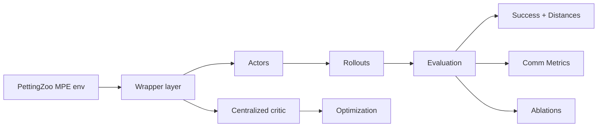

# Learn TorchRL + PettingZoo MPE MARL Communication in 60 Minutes
**An end-to-end CTDE tutorial with reproducible training, interpretable evaluation, and communication you can actually verify**

## Introduction

Most multi-agent reinforcement learning (MARL) tutorials fail in a very specific way.
They show you how to make loss curves move. They show you how to make reward plots wiggle. And then they quietly assume that coordination, cooperation, and communication must be happening underneath.
In practice, that assumption is usually wrong.
In MARL, it’s common for training to look healthy while agents fail to coordinate, messages carry no useful information, and evaluation-time success stays flat. If you’ve ever stared at a promising-looking training curve only to realize the agents still behave randomly, you’ve already seen this failure mode.
This tutorial is designed to prevent that.
In the next 60 minutes, you’ll build a complete, reproducible multi-agent RL pipeline using TorchRL and PettingZoo’s Multi-Agent Particle Environments (MPE) with one non-negotiable constraint:
We don’t trust learning unless we can prove it.
That means:
- Measuring success, not just returns
- Debugging behavior with goal-distance diagnostics, not intuition
- Verifying that communication is structured, stable, and causally useful
- Running everything in a Docker-first, restart-and-run-all workflow so results are repeatable
If you only remember one idea from this tutorial, let it be this:

> In multi-agent RL, loss curves are not evidence of coordination.  
> **Success, diagnostics, and ablations are.**

## What you’ll build in 60 minutes

By the end of this tutorial, you will have a pipeline you can rerun and trust:
    1    A MARL environment + wrapper layer
  - PettingZoo MPE task (e.g., simple_reference)
  - TorchRL-compatible wrappers
  - Explicit sanity checks for observation, action, and message channels
    2    CTDE training setup
  - Decentralized per-agent actors
  - Centralized critic for stable learning
    3    Outcome-aligned evaluation
  - Binary success rate as the primary metric
  - Goal-distance debugging to explain failures
    4    Communication verification
  - Message entropy
  - Message change rate
  - Observation-derived verification metrics
    5    (Optional but recommended) Causal ablations
  - Full communication
  - Disabled communication
  - Randomized communication

## When to use this stack

Use TorchRL + PettingZoo (MPE) when you want:
- A clean, local, reproducible MARL sandbox
- Explicit control over multi-agent observations, actions, and message channels
- A CTDE workflow that resembles real engineering practice
- A tutorial or research prototype you can reason about and debug
MPE is not realistic robotics—but it is excellent for:
- Understanding coordination failure modes
- Validating communication mechanisms
- Learning CTDE patterns you can reuse in harder environments

## Alternatives

Depending on your goals, other MARL stacks may be more appropriate:
- RLlib (Ray): scalable, production-oriented, heavier setup
- PyMARL / QMIX-style repos: strong value-decomposition baselines, less flexible
- SB3 + PettingZoo wrappers: simpler baselines, weaker MARL abstractions
- JAX-based stacks (Brax, Mava): extremely fast research workflows, steeper tooling curve
This tutorial uses TorchRL because it provides a PyTorch-native, modular RL pipeline, and PettingZoo because it offers the cleanest multi-agent environment API.

## Tutorial structure (the 60-minute roadmap)

This tutorial follows the standard “Learn X in 60 Minutes” structure:
    1    Setup (5 min) – Clone the repo, start Docker, launch Jupyter
    2    Introduction (10 min) – CTDE, success vs returns, what communication really means
    3    API exploration (20 min) – Inspect env specs, keys, and wrapper wiring
    4    Complete example (25 min) – Train, evaluate, and interpret communication
**The most important rule:**

> Always run the API notebook before training.

## Repo layout

The repository follows a consistent tutorial structure:
- `TorchRL_MAC_utils.py`
  - Environment creation and wrappers
  - Actor/critic builders
  - Rollout and training helpers
  - Evaluation utilities and communication diagnostics
- `TorchRL_MAC.API.ipynb` + `TorchRL_MAC.API.md`
  - Contract-style API walkthrough
  - Prints observation/action/message specs
  - Verifies wrapper correctness and wiring
- `TorchRL_MAC.example.ipynb` + `TorchRL_MAC.example.md`
  - Full end-to-end MARL pipeline
  - Training, evaluation, diagnostics, and ablations
- `Dockerfile`, `docker_build.sh`, `docker_bash.sh`
  - Self-sufficient execution environment (CPU-first for stability)

## 1) Setup (5 minutes)

### Option A: Docker (recommended)

```bash
./`docker_build.sh`
./`docker_bash.sh`
```

Or manually:

```bash
docker build -t torchrl-mac .
docker run --rm -it -p 8888:8888 torchrl-mac
```
Docker is recommended because it eliminates version drift and makes results reproducible.
### Option B: Local (conda)

```bash
conda create -n torchrl-mac python=3.10 -y
conda activate torchrl-mac
pip install -r requirements.txt
jupyter notebook
```
Then run, in order:

- ``TorchRL_MAC.API.ipynb``
- ``TorchRL_MAC.example.ipynb``

Always use **Restart & Run All**.

## 2) Introduction: CTDE and why success beats returns (10 minutes)

What “communication” means in MPE
In tasks like simple_reference, each agent has only partial information. To succeed, agents must exchange information through an explicit message channel.
Messages are produced by policies, transmitted to other agents, and become part of the next-step observation.
The key question is not whether messages exist—but whether policies use them.
Why CTDE
Centralized Training, Decentralized Execution (CTDE) is the standard MARL compromise:
- Centralized critics stabilize learning
- Decentralized actors execute with local information
Why success > returns
Shaped rewards often lie.
Success rate answers the real question:
Did the team solve the task?
Goal-distance debugging explains why it failed.

## 3) API exploration notebook (20 minutes)

Open and run:

- ``TorchRL_MAC.API.ipynb``
This notebook prevents silent failures.
You should explicitly verify:
- Observation tensor structure
- Action tensor structure
- Message channel key, shape, and dtype
- Agent ordering consistency
If anything is wrong here, training results are meaningless.

## 4) Complete example notebook (25 minutes)

Open and run:

- ``TorchRL_MAC.example.ipynb``
High-level workflow:


### Evaluation signals

- Success rate: binary task completion
- Goal distances: interpretable failure analysis

## 5) Proving communication is real

Communication can exist without being useful.
We measure:
- Message entropy: structure vs noise
- Message change rate: stability vs thrashing
- Observation-derived checks: wiring verification
Metrics are smoke alarms—not proofs.

## 6) Optional: communication ablations

Ablations turn intuition into a causal test:
- full_comm
- disable_comm
- random_comm
If communication matters, success should drop when it is removed or randomized.

## Reproducibility checklist

- Docker-first execution
- Fixed random seeds
- Restart-and-run-all notebooks
- API notebook run after dependency changes
- Multi-seed comparisons

## Troubleshooting

Success always zero:
- Check success_dist
- Inspect printed goal distances
- Verify correct environment version
Communication metrics stay random:
- Train longer
- Verify wiring in API notebook
- Run ablations

## Extensions

- Multi-task evaluation across MPE environments
- Seeded ablation studies
- Stronger communication probes
- Port the workflow to RWARE / TA-RWARE

## References

- TorchRL documentation
- PettingZoo documentation
- Multi-Agent Particle Environment paper
- CTDE and centralized critic literature
(Add explicit links and citations here.)

## Final takeaway

In multi-agent reinforcement learning, training curves are not evidence of coordination.
Success, diagnostics, and ablations are.