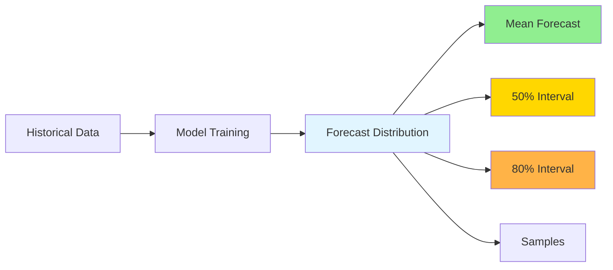
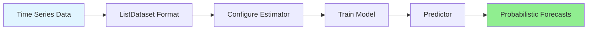
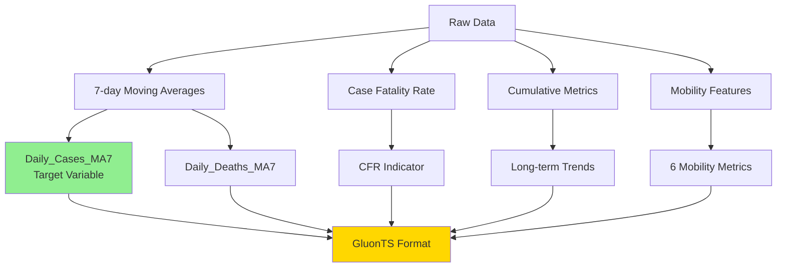

# Probabilistic Time Series Forecasting with GluonTS: Predicting COVID-19 Cases 

## Introduction

When public health officials plan hospital resources, a single number isn't enough. "We expect 10,000 COVID-19 cases next week" misses critical information: What if cases surge to 15,000? What if they drop to 5,000? Decision-makers need the full range of possibilities and their probabilities.

**Probabilistic time series forecasting** generates distributions of possible outcomes with confidence intervals, not just point predictions. This tutorial shows you how to build probabilistic forecasting models using GluonTS and apply them to COVID-19 case data.

### What You'll Learn

- **Why uncertainty matters**: How probabilistic forecasts enable better decision-making
- **How to use GluonTS**: Build and train probabilistic models with minimal code
- **Model selection**: Choose between DeepAR, SimpleFeedForward, and DeepNPTS
- **Interpretation skills**: Read prediction intervals and assess model confidence
- **Real-world application**: Apply forecasting to COVID-19 with scenario analysis

### Prerequisites

- Basic Python familiarity (pandas, numpy helpful)
- Understanding of time series concepts
- Docker installed
- About 60 minutes (15-20 min reading + 40-45 min hands-on)

**Getting Started**: Follow the [README](TutorTask297_GluonTS_COVID_19_Case_Prediction/README.md) to set up your environment, then run `./docker_jupyter.sh` to launch Jupyter notebooks.

---

## Understanding Probabilistic Forecasting

### Beyond Single Point Predictions

Traditional forecasting answers "What will happen?" with a single number. **Probabilistic forecasting** answers "What could happen, and how likely?" with a distribution.

**Example**: Instead of "Tomorrow will be 72°F," you get "68-76°F with 50% chance between 70-74°F."

### Why Uncertainty Matters

A hospital administrator sees "100 COVID-19 patients expected." But what if there's a 20% chance of 150 patients (surge) or 10% chance of 50 (decline)? Probabilistic forecasts enable:

- **Risk planning**: Allocate resources for worst-case scenarios
- **Informed decisions**: Balance preparedness against costs
- **Better communication**: "80% confident between Y and Z, 10% chance exceeding W"

### Key Concepts

#### Prediction Intervals

A **prediction interval** defines where the true value is likely to fall:

- **50% interval**: Middle 50% of outcomes (interquartile range)
- **80% interval**: 10th to 90th percentile
- **90% interval**: Very wide range, captures most scenarios

**Example**: 14-day forecast shows mean 8,500 cases, 50% interval [7,200, 9,800], 80% interval [6,000, 11,500].

#### Quantiles and Sample-Based Forecasts

**Quantiles** divide the distribution into equal-probability segments. Models generate forecasts by sampling many possible futures (e.g., 100 samples), forming a distribution:

```python
forecast.quantile(0.1)  # 10th percentile (lower bound)
forecast.quantile(0.5)  # Median
forecast.quantile(0.9)  # 90th percentile (upper bound)
```

More samples = smoother distributions (but slower computation).

#### Calibrated Uncertainty

**Calibrated uncertainty** means intervals are accurate: if a model claims "80% of outcomes in this range," then 80% of actual outcomes should fall within. **Uncalibrated models** are misleading (too narrow = overconfident, too wide = underconfident).

### Visualizing Probabilistic Forecasts



See forecast visualizations in the [GluonTS.API.ipynb notebook](TutorTask297_GluonTS_COVID_19_Case_Prediction/GluonTS.API.ipynb).

---

## Introduction to GluonTS

**GluonTS** (Gluon Time Series) is an open-source Python library for probabilistic time series forecasting. Developed by Amazon Research, it provides a consistent API for building, training, and evaluating forecasting models.

### Key Features

- **Probabilistic by default**: All models produce uncertainty estimates
- **Multiple architectures**: From simple feedforward to complex autoregressive models
- **Easy data handling**: Built-in utilities for time series preparation
- **Comprehensive evaluation**: Metrics for point and probabilistic forecasts
- **Production-ready**: Built on PyTorch/MXNet

### When to Use GluonTS

**Choose GluonTS when:**
- You need uncertainty quantification
- You have sufficient data (hundreds to thousands of time steps)
- You want to compare multiple architectures easily

**Consider alternatives:**
- **Prophet**: Strong seasonality, interpretable components
- **ARIMA**: Small datasets, classical statistical methods

### GluonTS Workflow



1. **Data Preparation**: Convert to `ListDataset` format
2. **Estimator**: Configure model parameters
3. **Training**: Fit model to historical data (`estimator.train()`)
4. **Predictor**: Trained model ready for forecasting
5. **Forecasts**: Probabilistic predictions with uncertainty intervals

### The Three Models

| Model | Best For | Training Time |
|-------|----------|---------------|
| **DeepAR** | Complex patterns, multiple seasonalities, highest accuracy | 2-4 min |
| **SimpleFeedForward** | Stable trends, quick baselines, limited compute | 30-60 sec |
| **DeepNPTS** | Regime shifts, distribution changes, flexible uncertainty | 1-3 min |

For detailed API documentation, see [GluonTS.API.md](tutorials/TutorTask297_GluonTS_COVID_19_Case_Prediction/GluonTS.API.md).

---

## The COVID-19 Forecasting Problem

### Problem Statement

Public health officials need 14-day COVID-19 case predictions to:
- **Allocate resources**: Plan ICU beds, ventilators, staffing
- **Plan interventions**: Decide on mask mandates, capacity limits
- **Communicate risk**: Inform the public about expected trends

A 14-day horizon balances planning time with forecast accuracy.

### Why COVID-19 Data is Ideal for Learning

COVID-19 case data exhibits:
1. **Multiple waves**: Distinct peaks (initial surge, Delta, Omicron) with different patterns
2. **Weekly seasonality**: Lower reporting on weekends
3. **External factors**: Mobility data, policy changes, variant emergence
4. **Noise and uncertainty**: Reporting delays, data quality issues
5. **Real-world impact**: Forecasts inform critical decisions

### Data Sources

#### 1. JHU COVID-19 Cases and Deaths
- **Cases**: Daily confirmed cases by state, aggregated nationally
- **Deaths**: Daily deaths by state
- **Period**: January 2020 - March 2023
- **Why deaths help**: Lag cases by 2-3 weeks but highly correlated, helps anticipate trends

#### 2. Google Mobility Data
- **Metrics**: Six categories (retail, grocery, parks, transit, workplaces, residential)
- **Format**: Percentage change from baseline
- **Why it matters**: Mobility changes precede case changes (reduced mobility → fewer cases with lag)

### Feature Engineering



1. **7-day moving averages**: Smooths weekend artifacts, reduces noise
2. **Case Fatality Rate (CFR)**: `Deaths / Cases` - healthcare strain indicator
3. **Cumulative metrics**: Long-term trends, less noisy
4. **Mobility features**: Behavioral response indicators

### Data Challenges

COVID-19 data presents forecasting challenges:
- **Non-stationarity**: Mean and variance change over time
- **Regime changes**: Different variants behave differently
- **Reporting artifacts**: Weekend underreporting, corrections
- **External shocks**: Policy changes, variant emergence
- **Noise**: Measurement error, reporting delays

These challenges make it an excellent testbed for probabilistic models that must adapt to changing patterns and quantify uncertainty appropriately.

Explore the data in [GluonTS.example.ipynb - Section 1](TutorTask297_GluonTS_COVID_19_Case_Prediction/GluonTS.example.ipynb).

---
