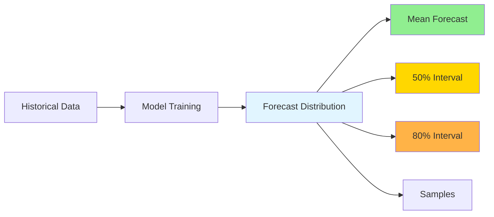
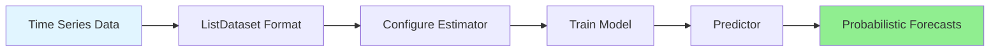
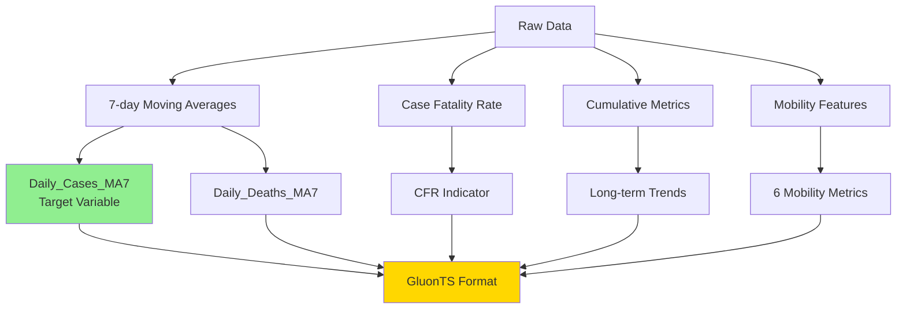
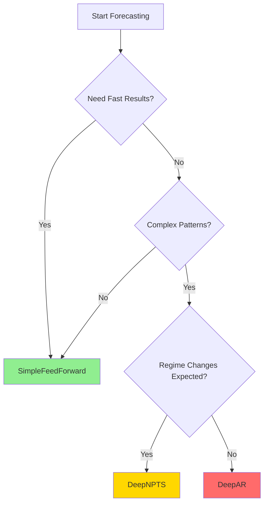

# Probabilistic Time Series Forecasting with GluonTS: Predicting COVID-19 Cases 

## Introduction

When public health officials plan hospital resources, a single number isn't enough. "We expect 10,000 COVID-19 cases next week" misses critical information: What if cases surge to 15,000? What if they drop to 5,000? Decision-makers need the full range of possibilities and their probabilities.

**Probabilistic time series forecasting** generates distributions of possible outcomes with confidence intervals, not just point predictions. This tutorial shows you how to build probabilistic forecasting models using GluonTS and apply them to COVID-19 case data.

### What You'll Learn

- **Why uncertainty matters**: How probabilistic forecasts enable better decision-making
- **How to use GluonTS**: Build and train probabilistic models with minimal code
- **Model selection**: Choose between DeepAR, SimpleFeedForward, and DeepNPTS
- **Interpretation skills**: Read prediction intervals and assess model confidence
- **Real-world application**: Apply forecasting to COVID-19 with scenario analysis

### Prerequisites

- Basic Python familiarity (pandas, numpy helpful)
- Understanding of time series concepts
- Docker installed
- About 60 minutes (15-20 min reading + 40-45 min hands-on)

**Getting Started**: Follow the [README](TutorTask297_GluonTS_COVID_19_Case_Prediction/README.md) to set up your environment, then run `./docker_jupyter.sh` to launch Jupyter notebooks.

---

## Understanding Probabilistic Forecasting

### Beyond Single Point Predictions

Traditional forecasting answers "What will happen?" with a single number. **Probabilistic forecasting** answers "What could happen, and how likely?" with a distribution.

**Example**: Instead of "Tomorrow will be 72°F," you get "68-76°F with 50% chance between 70-74°F."

### Why Uncertainty Matters

A hospital administrator sees "100 COVID-19 patients expected." But what if there's a 20% chance of 150 patients (surge) or 10% chance of 50 (decline)? Probabilistic forecasts enable:

- **Risk planning**: Allocate resources for worst-case scenarios
- **Informed decisions**: Balance preparedness against costs
- **Better communication**: "80% confident between Y and Z, 10% chance exceeding W"

### Key Concepts

#### Prediction Intervals

A **prediction interval** defines where the true value is likely to fall:

- **50% interval**: Middle 50% of outcomes (interquartile range)
- **80% interval**: 10th to 90th percentile
- **90% interval**: Very wide range, captures most scenarios

**Example**: 14-day forecast shows mean 8,500 cases, 50% interval [7,200, 9,800], 80% interval [6,000, 11,500].

#### Quantiles and Sample-Based Forecasts

**Quantiles** divide the distribution into equal-probability segments. Models generate forecasts by sampling many possible futures (e.g., 100 samples), forming a distribution:

```python
forecast.quantile(0.1)  # 10th percentile (lower bound)
forecast.quantile(0.5)  # Median
forecast.quantile(0.9)  # 90th percentile (upper bound)
```

More samples = smoother distributions (but slower computation).

#### Calibrated Uncertainty

**Calibrated uncertainty** means intervals are accurate: if a model claims "80% of outcomes in this range," then 80% of actual outcomes should fall within. **Uncalibrated models** are misleading (too narrow = overconfident, too wide = underconfident).

### Visualizing Probabilistic Forecasts



See forecast visualizations in the [GluonTS.API.ipynb notebook](TutorTask297_GluonTS_COVID_19_Case_Prediction/GluonTS.API.ipynb).

---

## Introduction to GluonTS

**GluonTS** (Gluon Time Series) is an open-source Python library for probabilistic time series forecasting. Developed by Amazon Research, it provides a consistent API for building, training, and evaluating forecasting models.

### Key Features

- **Probabilistic by default**: All models produce uncertainty estimates
- **Multiple architectures**: From simple feedforward to complex autoregressive models
- **Easy data handling**: Built-in utilities for time series preparation
- **Comprehensive evaluation**: Metrics for point and probabilistic forecasts
- **Production-ready**: Built on PyTorch/MXNet

### When to Use GluonTS

**Choose GluonTS when:**
- You need uncertainty quantification
- You have sufficient data (hundreds to thousands of time steps)
- You want to compare multiple architectures easily

**Consider alternatives:**
- **Prophet**: Strong seasonality, interpretable components
- **ARIMA**: Small datasets, classical statistical methods

### GluonTS Workflow



1. **Data Preparation**: Convert to `ListDataset` format
2. **Estimator**: Configure model parameters
3. **Training**: Fit model to historical data (`estimator.train()`)
4. **Predictor**: Trained model ready for forecasting
5. **Forecasts**: Probabilistic predictions with uncertainty intervals

### The Three Models

| Model | Best For | Training Time |
|-------|----------|---------------|
| **DeepAR** | Complex patterns, multiple seasonalities, highest accuracy | 2-4 min |
| **SimpleFeedForward** | Stable trends, quick baselines, limited compute | 30-60 sec |
| **DeepNPTS** | Regime shifts, distribution changes, flexible uncertainty | 1-3 min |

For detailed API documentation, see [GluonTS.API.md](tutorials/TutorTask297_GluonTS_COVID_19_Case_Prediction/GluonTS.API.md).

---

## The COVID-19 Forecasting Problem

### Problem Statement

Public health officials need 14-day COVID-19 case predictions to:
- **Allocate resources**: Plan ICU beds, ventilators, staffing
- **Plan interventions**: Decide on mask mandates, capacity limits
- **Communicate risk**: Inform the public about expected trends

A 14-day horizon balances planning time with forecast accuracy.

### Why COVID-19 Data is Ideal for Learning

COVID-19 case data exhibits:
1. **Multiple waves**: Distinct peaks (initial surge, Delta, Omicron) with different patterns
2. **Weekly seasonality**: Lower reporting on weekends
3. **External factors**: Mobility data, policy changes, variant emergence
4. **Noise and uncertainty**: Reporting delays, data quality issues
5. **Real-world impact**: Forecasts inform critical decisions

### Data Sources

#### 1. JHU COVID-19 Cases and Deaths
- **Cases**: Daily confirmed cases by state, aggregated nationally
- **Deaths**: Daily deaths by state
- **Period**: January 2020 - March 2023
- **Why deaths help**: Lag cases by 2-3 weeks but highly correlated, helps anticipate trends

#### 2. Google Mobility Data
- **Metrics**: Six categories (retail, grocery, parks, transit, workplaces, residential)
- **Format**: Percentage change from baseline
- **Why it matters**: Mobility changes precede case changes (reduced mobility → fewer cases with lag)

### Feature Engineering



1. **7-day moving averages**: Smooths weekend artifacts, reduces noise
2. **Case Fatality Rate (CFR)**: `Deaths / Cases` - healthcare strain indicator
3. **Cumulative metrics**: Long-term trends, less noisy
4. **Mobility features**: Behavioral response indicators

### Data Challenges

COVID-19 data presents forecasting challenges:
- **Non-stationarity**: Mean and variance change over time
- **Regime changes**: Different variants behave differently
- **Reporting artifacts**: Weekend underreporting, corrections
- **External shocks**: Policy changes, variant emergence
- **Noise**: Measurement error, reporting delays

These challenges make it an excellent testbed for probabilistic models that must adapt to changing patterns and quantify uncertainty appropriately.

Explore the data in [GluonTS.example.ipynb - Section 1](TutorTask297_GluonTS_COVID_19_Case_Prediction/GluonTS.example.ipynb).

---

## Three Models, Three Approaches

Each model has distinct strengths suited to different forecasting scenarios. Understanding when to use each helps you choose the right tool for your problem.

### DeepAR: Complex Patterns and High Accuracy

**What it does:** Uses recurrent neural networks (RNNs) to learn temporal dependencies and patterns.

**When to use:**
- Complex patterns with multiple seasonalities
- Long-term dependencies matter
- Highest accuracy is critical
- Sufficient training data available

**Strengths:**
- Best overall accuracy
- Captures wave dynamics and seasonality
- Well-calibrated uncertainty estimates
- Handles external features effectively

**Configuration highlights:**
- `context_length=60`: 2 months of history
- `num_layers=2`: Deep enough for complex patterns
- `hidden_size=40`: Balanced capacity
- `num_feat_dynamic_real=3`: Uses deaths, CFR, mobility features

**Training time:** 2-4 minutes

### SimpleFeedForward: Fast Baseline

**What it does:** Direct mapping from recent history to future predictions using feedforward networks.

**When to use:**
- Need fast results
- Stable, predictable trends
- Quick baseline comparison
- Limited computational resources

**Strengths:**
- 10x faster than DeepAR
- Good for stable periods
- Excellent for prototyping
- No external features needed

**Limitations:**
- Struggles with sudden changes
- Less accurate for complex patterns
- No feature support

**Training time:** 30-60 seconds

### DeepNPTS: Regime Changes and Flexibility

**What it does:** Learns data distribution non-parametrically, adapting to changing patterns.

**When to use:**
- Distribution changes over time
- Regime shifts expected (new variants)
- Unusual, non-standard data
- Heavy tails or rare events

**Strengths:**
- Adapts to distribution shifts
- Excellent during variant transitions
- Flexible uncertainty estimates
- Handles external features

**Training time:** 1-3 minutes

### Model Selection Guide



**Quick reference:**
- **Stable trends, quick baseline** → SimpleFeedForward
- **Complex patterns, highest accuracy** → DeepAR
- **Regime changes, variant transitions** → DeepNPTS

See detailed model comparisons in [GluonTS.API.ipynb](TutorTask297_GluonTS_COVID_19_Case_Prediction/GluonTS.API.ipynb).

---

## Hands-On: Building Your First Forecast

Here's a quick walkthrough of the essential steps to build a probabilistic forecast with GluonTS.

### Step 1: Data Preparation

Convert your time series into GluonTS `ListDataset` format:

```python
from gluonts.dataset.common import ListDataset

train_ds = ListDataset([
    {
        "start": "2020-01-01",
        "target": [cases_day1, cases_day2, ...],  # Your time series
        "feat_dynamic_real": [[deaths_day1, ...],  # Optional features
                             [mobility_day1, ...]]
    }
], freq="D")
```

**Key points:**
- `start`: First timestamp
- `target`: Time series values (list or array)
- `feat_dynamic_real`: External features (2D array, optional)
- `freq`: Pandas frequency string ('D' for daily)

### Step 2: Model Configuration

Configure your estimator with key parameters:

```python
from gluonts.torch.model.deepar import DeepAREstimator

estimator = DeepAREstimator(
    freq='D',
    prediction_length=14,  # Forecast 14 days ahead
    context_length=60,      # Use 60 days of history
    num_feat_dynamic_real=3,  # 3 external features
    trainer_kwargs={"max_epochs": 10}
)
```

### Step 3: Training

Fit the model to historical data:

```python
predictor = estimator.train(train_ds)
```

During training, the model learns patterns, dependencies, and uncertainty distributions from your data.

### Step 4: Generating Forecasts

Generate probabilistic forecasts:

```python
from gluonts.evaluation import make_evaluation_predictions

forecast_it, ts_it = make_evaluation_predictions(
    dataset=test_ds,
    predictor=predictor,
    num_samples=100  # Generate 100 samples for distribution
)

forecasts = list(forecast_it)
```

### Step 5: Extracting Uncertainty

Access probabilistic outputs:

```python
forecast = forecasts[0]

# Point predictions
mean = forecast.mean
median = forecast.quantile(0.5)

# Confidence intervals
lower_80 = forecast.quantile(0.1)  # 10th percentile
upper_80 = forecast.quantile(0.9)  # 90th percentile

# All samples
samples = forecast.samples  # Shape: (100, 14)
```

See the complete walkthrough in [GluonTS.example.ipynb](TutorTask297_GluonTS_COVID_19_Case_Prediction/GluonTS.example.ipynb).

---

## Interpreting Probabilistic Forecasts

Understanding probabilistic forecasts requires interpreting prediction intervals, assessing confidence, and recognizing common pitfalls.

### Reading Prediction Intervals

**What do 10th-90th percentiles mean?**
- **10th percentile**: 10% of outcomes fall below this value (lower bound)
- **90th percentile**: 90% of outcomes fall below this value (upper bound)
- **80% interval**: 80% of likely outcomes fall between these bounds

**Example:** If the 80% interval is [6,000, 11,500] cases, there's an 80% chance the actual value falls within this range.

### Assessing Model Confidence

**Narrow intervals** = High confidence
- Model is certain about the forecast
- Low uncertainty in predictions
- May indicate overconfidence if intervals are too narrow

**Wide intervals** = High uncertainty
- Model acknowledges uncertainty
- May be due to noise, regime changes, or limited data
- More realistic for volatile time series

### When to Trust Forecasts

**Trust forecasts when:**
- Intervals are well-calibrated (actual outcomes match predicted intervals)
- Historical performance is good
- Data quality is high
- No recent regime changes

**Be cautious when:**
- Intervals are too narrow (overconfident)
- Intervals are too wide (underconfident)
- Recent data shows distribution shifts
- External factors have changed significantly

### Common Pitfalls

1. **Overconfidence**: Too narrow intervals → claims 80% interval but only 60% of outcomes fall within
2. **Underconfidence**: Too wide intervals → claims 80% interval but 95% of outcomes fall within
3. **Ignoring uncertainty**: Making decisions based only on mean forecast, ignoring intervals

**Best practice:** Always consider the full distribution, not just the mean forecast.

See forecast interpretation examples in [GluonTS.example.ipynb - Section 5](TutorTask297_GluonTS_COVID_19_Case_Prediction/GluonTS.example.ipynb).

---

## Model Evaluation: Beyond Accuracy

Evaluating probabilistic forecasts requires metrics beyond point forecast accuracy.

### Point Forecast Metrics

**MAE (Mean Absolute Error):** Average absolute difference between predictions and actuals
- Easy to interpret (in original units)
- Robust to outliers

**RMSE (Root Mean Square Error):** Penalizes large errors more
- Common forecasting metric
- In same units as target

**MAPE (Mean Absolute Percentage Error):** Scale-independent percentage error
- Useful for comparison across scales
- Interpretation: average % error

### Probabilistic Metrics

**CRPS (Continuous Ranked Probability Score):** Evaluates the full forecast distribution
- Lower is better
- Rewards well-calibrated uncertainty
- Considers entire distribution, not just mean

**Why CRPS matters:**
- A model can have good MAE but poor uncertainty estimates
- CRPS evaluates probabilistic forecast quality
- Both accuracy and uncertainty quality matter for decision-making

### Comparing Models

When comparing models, consider:
- **Accuracy**: Which has lowest MAE/RMSE?
- **Uncertainty quality**: Which has lowest CRPS?
- **Calibration**: Are intervals accurate?
- **Speed**: Training time matters for production

**Example comparison:**
- **DeepAR**: Best accuracy (lowest MAE), well-calibrated uncertainty (low CRPS)
- **SimpleFeedForward**: Good accuracy, acceptable uncertainty, fastest
- **DeepNPTS**: Good accuracy, flexible uncertainty, adapts to changes

See evaluation code and metrics in [GluonTS.example.ipynb - Section 5](TutorTask297_GluonTS_COVID_19_Case_Prediction/GluonTS.example.ipynb).

---

## Real-World Application: Scenario Analysis

Probabilistic forecasts enable "what-if" analysis for decision-making. Here's how to use forecasts for scenario planning.

### What is Scenario Analysis?

Simulating different intervention scenarios to quantify their impact on case counts. This helps public health officials:
- Evaluate intervention effectiveness before implementation
- Balance health outcomes with economic costs
- Plan resource allocation under different scenarios
- Communicate risk to stakeholders

### How It Works

1. **Adjust features** by intervention strength (e.g., reduce mobility by 20%)
2. **Re-run forecasts** with modified features
3. **Compare predictions** across scenarios
4. **Quantify impact** of interventions

### Example Scenarios

**Scenario 1: Baseline (No Intervention)**
- Current trends continue
- No policy changes
- Forecast: Expected trajectory

**Scenario 2: Moderate Intervention**
- 20% reduction in mobility
- Simulates mask mandates, capacity limits
- Forecast: Slower case growth

**Scenario 3: Strong Intervention**
- 40% reduction in mobility
- Simulates lockdowns, school closures
- Forecast: Significant case reduction

### Interpreting Results

**Example output:**
```
Scenario              Predicted Cases (14 days)    Reduction
----------------------------------------------------------------
Baseline              65,000 (±8,000)              --
Moderate (-20%)       52,000 (±6,500)              20% fewer
Strong (-40%)         38,000 (±5,000)              42% fewer
```

**Key insights:**
- Quantify intervention impact with uncertainty bounds
- Compare scenarios probabilistically (not just point estimates)
- Make informed decisions balancing multiple factors

See complete scenario analysis in [GluonTS.example.ipynb - Section 7](TutorTask297_GluonTS_COVID_19_Case_Prediction/GluonTS.example.ipynb).

---

## Key Takeaways and Next Steps

### Why Probabilistic Forecasting Matters

Throughout this tutorial, we've seen how probabilistic forecasting moves beyond single point predictions to capture **uncertainty, trends, and variability**—critical for informed decision-making in public health. Unlike traditional forecasts that say "10,000 cases expected," probabilistic models provide "10,000 cases with 80% confidence interval [8,000-12,000]," enabling risk-aware planning.

### Handling Noisy, Evolving Time Series

COVID-19 data exemplifies the challenges of **noisy, evolving time series**:

- **Noise**: Reporting delays, weekend underreporting, data corrections
- **Evolving patterns**: Multiple waves (Delta, Omicron) with different characteristics
- **Regime changes**: Distribution shifts as variants emerge

**How GluonTS models handle these challenges:**

1. **7-day moving averages**: Smooth noise while preserving trends
2. **DeepAR**: Captures complex temporal patterns and seasonality despite noise
3. **DeepNPTS**: Adapts to distribution shifts and regime changes non-parametrically
4. **External features**: Deaths and mobility data help anticipate evolving patterns
5. **Uncertainty quantification**: Wide intervals signal high uncertainty during transitions

Probabilistic models don't just predict—they **quantify uncertainty** and **adapt to variability**, making them essential for real-world forecasting.

### When to Use Each Model

**Quick reference guide:**

| Model | Use When | Key Strength |
|-------|----------|--------------|
| **SimpleFeedForward** | Stable trends, fast baseline needed | Speed (30-60 sec) |
| **DeepAR** | Complex patterns, highest accuracy needed | Accuracy + calibrated uncertainty |
| **DeepNPTS** | Regime changes, distribution shifts expected | Adaptability to evolving patterns |

**Decision flow:** Need fast results? → SimpleFeedForward. Complex patterns? → DeepAR. Regime changes? → DeepNPTS.

### Best Practices

1. **Always report uncertainty**: Point forecasts alone are insufficient for decision-making
2. **Choose model based on problem**: Consider data characteristics (stable vs. evolving, noisy vs. clean)
3. **Validate on holdout data**: Test model performance before deployment
4. **Monitor calibration**: Ensure prediction intervals match actual outcomes
5. **Consider external features**: They can significantly improve forecasts for evolving patterns

### Extending This Tutorial

**Try different forecast horizons:**
- Short-term (7 days): Operational planning
- Medium-term (14 days): Current choice, matches public health cycles
- Long-term (28 days): Strategic planning (lower accuracy expected)

**Add more features:**
- Vaccination rates (available in `data/vaccine.csv`)
- Weather data (temperature, humidity)
- Policy stringency indices
- Genomic surveillance (variant prevalence)

**Experiment with hyperparameters:**
- Increase `context_length` for longer historical context
- Adjust `hidden_size` or `num_layers` for model capacity
- Tune `dropout_rate` for regularization
- Increase `epochs` for better accuracy (slower training)

**Apply to your own data:**
- Replace COVID-19 data with your time series
- Adapt feature engineering to your domain
- Compare models on your specific problem
- Build scenario analysis for your use case

### Additional Resources

**GluonTS Documentation:**
- [Official Documentation](https://ts.gluon.ai/)
- [GitHub Repository](https://github.com/awslabs/gluonts)
- [API Reference](TutorTask297_GluonTS_COVID_19_Case_Prediction/GluonTS.API.md)

**Research Papers:**
- [DeepAR Paper](https://arxiv.org/abs/1704.04110)
- [DeepNPTS Paper](https://arxiv.org/abs/1906.05264)

**COVID-19 Data Sources:**
- [JHU COVID-19 Repository](https://github.com/CSSEGISandData/COVID-19)
- [Google Mobility Reports](https://www.google.com/covid19/mobility/)

**Time Series Forecasting:**
- "Forecasting: Principles and Practice" by Hyndman & Athanasopoulos
- [PyTorch Lightning Documentation](https://lightning.ai/docs/pytorch/stable/)

### Final Thoughts

Probabilistic time series forecasting with GluonTS enables you to:
- **Capture uncertainty** in predictions, not just point estimates
- **Handle noisy, evolving data** through appropriate model selection
- **Make informed decisions** using prediction intervals and scenario analysis
- **Adapt to changing patterns** with models like DeepNPTS

Whether forecasting COVID-19 cases, sales, or any time series, probabilistic forecasts provide the **uncertainty quantification** and **variability awareness** needed for real-world decision-making.

**Ready to get started?** Follow the [README](TutorTask297_GluonTS_COVID_19_Case_Prediction/README.md) to set up your environment, then dive into the [GluonTS.API.ipynb](TutorTask297_GluonTS_COVID_19_Case_Prediction/GluonTS.API.ipynb) and [GluonTS.example.ipynb](TutorTask297_GluonTS_COVID_19_Case_Prediction/GluonTS.example.ipynb) notebooks to build your own probabilistic forecasts.

---
