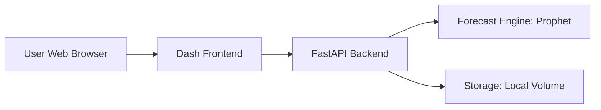

<!-- toc -->

- [Forecast as a Service](#forecast-as-a-service)
  * [Introduction](#introduction)
  * [System Architecture](#system-architecture)
  * [Component Overview](#component-overview)
    + [Dash Frontend](#dash-frontend)
    + [Fastapi Backend](#fastapi-backend)
    + [Forecast Engine](#forecast-engine)
    + [Data Flow](#data-flow)
  * [Environment and Deployment](#environment-and-deployment)
  * [Known Limitations](#known-limitations)
  * [Future Improvements](#future-improvements)

<!-- tocstop -->

# Forecast as a Service

## Introduction

- This guide:
  - Describes the architecture of the Forecast-as-a-Service system
  - Explains how the Dash frontend, FastAPI backend, and forecasting engine
    interact
  - Shows how to run, extend, and customize the system effectively

## System Architecture



- There are two containers:
  - a Dash app for interaction
  - a FastAPI server for processing
    - Uses Prophet to perform time series forecasting
- The containers are Orchestrated via Docker Compose

## Component Overview

### Dash Frontend

- Built using Plotly Dash
- Handles CSV upload
- Sends data to the FastAPI /forecast endpoint
- Displays visual output

### Fastapi Backend

- Handles `/upload_data` and `/forecast`
- Parses uploaded CSVs, validates input, and invokes forecasting logic
- Uses Pydantic models defined in `api/schemas.py`
- Main server entrypoint: `api/main.py`

### Forecast Engine

- Uses Facebook Prophet for univariate forecasting
- Logic is encapsulated in `api/services.py`
- Can be extended to support other models by modifying the `run_forecast()`
  function

### Data Flow

- User uploads a CSV via the UI
- Frontend sends POST to FastAPI /forecast
- Backend parses and validates the file
- Forecast is computed using Prophet
- Result is sent back and plotted interactively

## Environment and Deployment

- Environment is configured via `setenv.sh` and `invoke.yaml`
- The Docker image is tagged with `--version`, allowing multiple builds
- Ports 8000 (backend) and 8050 (frontend) must be available
- To run forecast UI:

  ```bash
  > ./devops/docker_run/run_docker_forecast.sh <version>
  ```

## Known Limitations

- The forecast service must be launched via `run_docker_forecast.sh`, not
  through `invoke`
- The frontend and backend services are hardcoded to ports `8050` and `8000`,
  respectively. This can cause conflicts on shared environments
- Only Prophet model is currently supported
- Only single forecast per request

## Future Improvements

- Create an invoke task (e.g., `invoke docker_forecast`) similar to
  `docker_bash` and `docker_jupyter`
- Externalize port configuration into `.env` or accept CLI args
- Refactor engine to use a plug-in registry for multiple model backends
- Integrate background job processing to allow batching or queuing system
