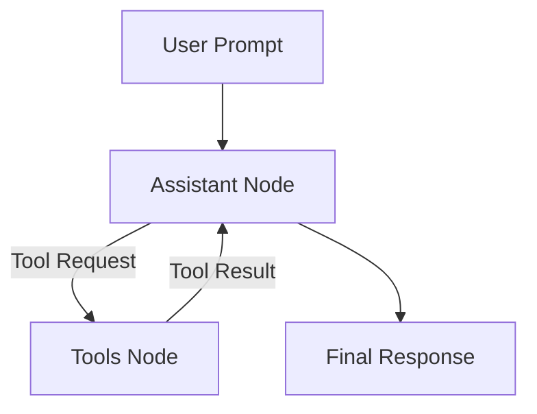

# Langgraph Tutorial

<!-- toc -->

- [Overview](#overview)
  * [Alternatives](#alternatives)
- [Getting Started](#getting-started)
  * [Prerequisites](#prerequisites)
  * [Installation](#installation)
- [Langgraph Agent Overview](#langgraph-agent-overview)
  * [Architecture](#architecture)
  * [Example: EDA Agent](#example-eda-agent)
- [Current Limitations](#current-limitations)
- [Future Improvements](#future-improvements)

<!-- tocstop -->

## Overview

- LangGraph is a graph-based orchestration framework built on top of LangChain
- This tutorial demonstrates how to build a minimal EDA (Exploratory Data
  Analysis) agent that:
  - Accepts natural language prompts
  - Selects the correct analysis tool automatically
  - Executes the tool and returns results (tables, plots, summaries)

- **What problem does it solve?**
  - Automates repetitive EDA tasks (preview, describe, aggregate, visualize)
  - Provides transparent tool execution with reproducible Python snippets
  - Simplifies building AI agents that are safe (restricted to predefined tools)

### Alternatives

1. **Open Source:**
   - Pure LangChain Agents
     - Advantages: Large ecosystem of integrations
     - Disadvantages: Higher complexity, less explicit graph flow
2. **Commercial APIs:**
   - OpenAI Assistants API
     - Advantages: Rich, production-ready assistants with memory
     - Disadvantages: Less control over agent reasoning
   - Anthropic Claude (used here)
     - Advantages: Strong coding/reasoning, affordable
     - Disadvantages: Requires API key

## Getting Started

### Prerequisites

1. **API Key:** Sign up for an Anthropic account and get a Claude API key
2. **Set Environment Variable:**
   ```bash
   export ANTHROPIC_API_KEY="<your_api_key_here>"
   ```

### Installation

- Install required libraries, skip if using docker environment::
  ```python
  !pip install langgraph langchain-anthropic
  ```
- Other dependencies:
  ```python
  import logging
  import os
  from typing import Annotated, TypedDict
  import matplotlib.pyplot as plt
  import numpy as np
  import pandas as pd
  ```

## Langgraph Agent Overview

- The agent is a graph of nodes:
  - Assistant Node: Decides whether to call a tool or respond
  - Tool Node: Executes existing tools like `read_head`, `plot_histogram`,
    `groupby_agg`
  - Edges: Control the flow between assistant and tools

### Architecture



### Example: EDA Agent

1. Define EDA tools

```python
@lc_tools.tool
def read_head(path: str, n: int = 5) -> str:
    df = pd.read_csv(path)
    display(df.head(n))
    return "Displayed preview."

@lc_tools.tool
def plot_histogram(path: str, column: str) -> str:
    df = pd.read_csv(path)
    df[column].hist(bins=20)
    return "Displayed histogram."

@lc_tools.tool
def groupby_agg(path: str, by: str, metric: str) -> str:
    df = pd.read_csv(path)
    grouped = df.groupby(by)[metric].mean().reset_index()
    display(grouped)
    return "Displayed grouped means."
```

2. Build the LangGraph

```python
class AgentState(TypedDict):
    """
    Accumulate chat messages.
    """

    messages: Annotated[list[lc_messages.AnyMessage], lg_msg.add_messages]

# Model with Tools Bound.
llm = lc_anthropic.ChatAnthropic(
    model="claude-3-5-sonnet-latest", temperature=0, max_tokens=1024
).bind_tools(EDA_TOOLS)

def assistant_node(state: AgentState) -> dict:
    """
    Tell me to produce the next AI message given the conversation.
    """
    ai_msg = llm.invoke(state["messages"])
    return {"messages": [ai_msg]}

# Tool Node Executes Tools When the Model Requests Them.
tools_node = lg_prebuilt.ToolNode(EDA_TOOLS)
# Build the Graph.
graph = lg_graph.StateGraph(AgentState)
graph.add_node("assistant", assistant_node)
graph.add_node("tools", tools_node)
# Assistant Decides Either: Call Tools -> Go to Tools; or Respond -> END.
graph.add_conditional_edges("assistant", lg_prebuilt.tools_condition)
graph.add_edge("tools", "assistant")
graph.set_entry_point("assistant")
app = graph.compile()
print("Graph compiled.")
```

3. Run the agent

```python
# Define System Behavior and User Input.
sys_msg = lc_messages.SystemMessage(
    content=(
        "You have EDA tools for previewing rows, plotting histograms, and grouped aggregations. "
        "When a user asks for EDA, choose and call the most relevant tool. "
        "Prefer calling a tool over writing code or prose whenever a tool can do the task. "
        "After executing any tool, always append a Python code block that reproduces the exact call"
        ", include every call made this turn."
    )
)

def run_turn(user_text: str):
    state = {"messages": [sys_msg, lc_messages.HumanMessage(content=user_text)]}
    final = None
    for event in app.stream(state, stream_mode="values"):
        final = event["messages"][-1]
    return final
```

- Example 1: Preview rows

  ```python
  response = run_turn("Show the first 3 rows of demo_sales.csv.")
  print(response.content)
  ```

  - Output:

    ````bash
    Here's the Python code to reproduce this preview:

    ```python
    read_head(path="demo_sales.csv", n=3)
    ```
    ````

- Example 2: Plot histogram

  ```python
  final_2 = run_turn(
    f"Plot a histogram of the 'units_sold' column from {demo_csv_path}."
  )
  print(final_2.content)
  ```

  - Output:

    ````bash
    Here's the Python code to reproduce this visualization:

    ```python
    plot_histogram(path="demo_sales.csv", column="units_sold")
    ```
    ````

- Example 3: Groupby aggregation

  ```python
  final_3 = run_turn(
    f"What is the average of 'units_sold' by 'region' in {demo_csv_path}?"
  )
  print(final_3.content)
  ```

  - Output:

    ````bash
    Here's the Python code to reproduce this analysis:

    ```python
    groupby_agg(path="demo_sales.csv", by="region", metric="units_sold")
    ```
    ````

- Example 4: Preview head and plot histogram

  ```python
  final_4 = run_turn(
    f"Show the first 7 rows of {demo_csv_path}. Then, plot a histogram of the 'units_sold' column."
  )
  print(final_4.content)
  ```

  - Output:

    ````bash
    Here's the Python code to reproduce these operations:

    ```python
    read_head(path="demo_sales.csv", n=7)
    plot_histogram(path="demo_sales.csv", column="units_sold")
    ```
    ````

## Current Limitations

- Every callable function must be explicitly tagged with `@lc_tools.tool` for
  the agent to recognize and invoke it
- Agents are tied to whichever LLM backend they're bound to (e.g., Claude,
  OpenAI, Mistral). Switching models often requires re-binding and retuning
  prompts
- LangGraph agents are stateless, they cannot recall prior queries or maintain
  session memory without explicit state management

## Future Improvements

- Allow automatic introspection of available functions instead of requiring
  explicit `@lc_tools.tool` tagging
- Enable agents to call different backends (Claude for reasoning, GPT-4 for
  summarization, Mistral for efficiency) within the same graph
- Add persistent conversation history, vector stores, or episodic memory modules
  that can be attached to the graph
