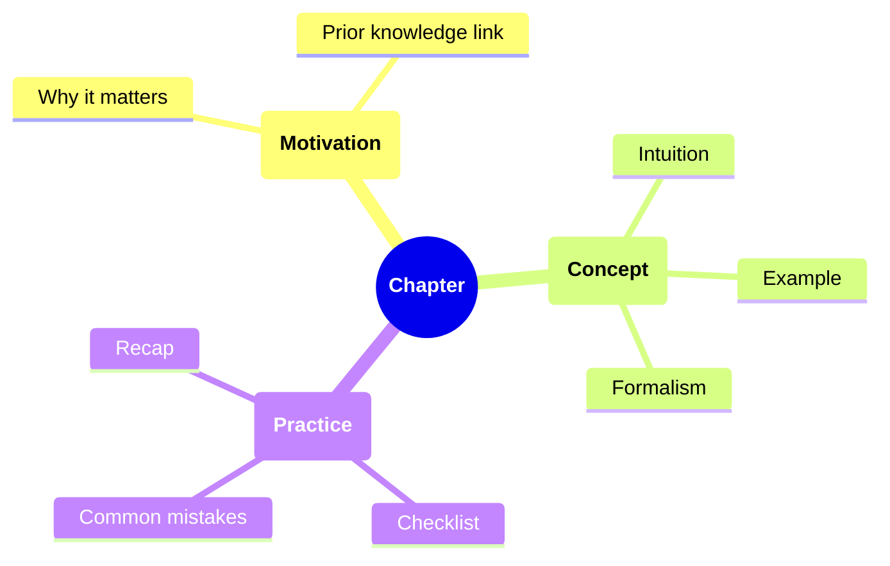

TL;DR: AI can already teach any topic on demand, so a technical book only earns
its place if it teaches judgment, hard-won lessons, and structure that AI slop
does not provide.

<!-- more -->

# How to Write Book and Technical Content for Humans (and AI)

- AI can already answer almost any question with depth and proficiency
    - It writes a book on any topic, tailored to the reader's level, from ELI5
      to PhD
    - It acts as a patient tutor that answers follow-up questions instantly and
      at near-zero cost

- This raises two questions:
    - Why write technical content at all, if AI can generate it on demand
    - What happens to the old idea of a "book" as a fixed, authored artifact

## Why Human-Written Books Still Matter

- AI optimizes for consensus and average, since it is trained to predict the
  most likely next token
    - It underrepresents edge cases and non-linear paths to success
    - A human author can add hard-won lessons from the field that AI cannot
      reconstruct on its own

- Content that used to be foundational is now often a distraction
    - E.g., deriving backpropagation from scratch or working through linear
      algebra by hand
    - This is exactly the kind of standard content a reader can already get from
      AI on request
    - A book should spend its limited attention budget on what AI cannot easily
      supply

- What is worth teaching is judgment, not syntax
    - When to apply a technique
    - What to do when results do not match expectations
    - How to critique a result or an approach
    - How to hold a mental model of competing approaches

## Write for the Era of Limited Attention

- Readers face constant pressure toward shortcuts and clickbait
    - E.g., "a little-known secret", "the 1-hour trick billionaires use"

- A technical book should resist this pressure while still respecting limited
  attention
    - Avoid (actually abhor) anything that is or resembles AI slop
    - Optimize for human learning: visual structure and active recall
    - Organize information hierarchically, in bullet-point form

- Embrace AI as a tool rather than ignoring it
    - Share the prompts and automation that made the work easier
    - Let readers reuse the same shortcuts the author used

## Structure Content Around Questions

- Think of a book as a hybrid between a textbook and a student's notebook
- Start each section with the key question it answers
    - E.g., _Why does this matter?_
- Start with the main topic, then indent subtopics and details underneath it

### Bullet Everything Possible

- Use nested bullet points to show the hierarchy of concepts
- Keep each bullet to one idea
- Group bullets under a clear heading
    - E.g.:

        ```markdown
        ### Causes of X

        - Environmental
            - Pollution
            - Resource scarcity
        - Economic
            - Inflation
            - Market failures
        ```

### Chunk by One Concept per Section

- Treat each section or page as exactly one concept
- Support the concept with a boxed summary, a figure, or a formula

### Use Note-Like Formatting

- Checklists for processes
- Questions for reflection
- Insights and mnemonics
- Recap points that link back to earlier topics

### Write Like You Are Explaining to Yourself

- Avoid long prose
- Use a first-person note voice
    - E.g.:
        ```text
        Key thing to remember: entropy increases.
        ```
- Prefer plain language over academic jargon

## Pedagogical Progression

- **Start with motivation**: explain why the topic matters before diving into
  details
- **Intuition before formalism**: explain the concept intuitively, then give the
  mathematical formalism
- **Build incrementally**: progress from simple to complex, referencing earlier
  concepts
- **Use multiple representations**: combine text, equations, diagrams, and
  real-world examples
- **Concrete examples**: always include a practical example, explicitly labeled
- **Reference context**: connect new concepts back to material introduced
  earlier

## Engagement Strategies

- **Open with motivation**: ask _why does this matter?_ before explaining what
  something is
- **Use questions**: mark a rhetorical question with `**Question**:`
- **Ground in examples**: always include an `**Example**:` with a concrete
  scenario
- **Reference prior knowledge**: connect back with a phrase such as "as we saw
  in [previous topic]"
- **Contrast approaches**: show what does not work next to what does

## Use Diagrams Over Text

- Summarize systems and relationships with Graphviz, Mermaid, or TikZ-style
  charts instead of long text descriptions
- Add annotation arrows and layered explanations to diagrams
- Mark core ideas with dedicated tags so they are easy to scan, e.g.:
    - **Key Insight**
    - **Common Mistake**
    - **Rule of Thumb**

- The overall structure of a book chapter can be summarized as its own
  hierarchy:



- Structure content the way a math book structures a proof
    - Definition
    - Theorem
    - Claim

## Recommended Layout Conventions

| **Element**     | **Format Example**              |
| :-------------- | :------------------------------ |
| Section headers | `## Concept Name`               |
| Sub-concepts    | `### Why It Matters`            |
| Definitions     | `**Term:** definition`          |
| Equations       | Displayed in LaTeX with context |
| Diagrams        | Centered with labels            |
| Summaries       | Boxed bullets with takeaways    |

- A book written this way serves two readers at once
    - A human skimming for structure and active recall
    - An AI parsing hierarchy and definitions to answer follow-up questions
      accurately
