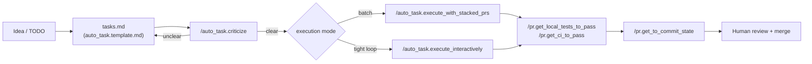

TL;DR: How my agentic engineering flow has been shaping up

<!-- more -->

- This blog describes the `auto_task` flow: the convention I use to turn a problem
  into a spec, have an agent critique the spec, and then execute it as one or more
  branches and PRs
- It complements two companion posts:
  [A Queue of AI Coding Agents](/blog/a-queue-of-ai-coding-agents) covers how tasks
  get _into_ the queue, and
  [Stacked PRs for Agentic Development](/blog/stacked-prs-for-agentic-development)
  covers _how_ a multi-step task gets executed as a stack
- This post is the map that ties the pieces together

## The Unit of Work

- In my workflow, every unit of work maps to one GitHub issue
  - Most issues become a single Git branch and a single PR
  - A large refactor can span multiple branches / PRs for the same issue, e.g., split
    into chunks for safety and ease of review
- Branches and PRs are named after the issue:
  `<RepoPrefix>Task<IssueNum>_<Description>` (e.g.,
  `UmdTask557_Improve_msml6103_2_and_3_3_slides`), with a numeric suffix (`_1`, `_2`,
  ...) when one issue produces more than one branch

## The Spec Format

- Before any code is written, the problem and the solution are captured in a plan
  that follows a fixed template, `auto_task.template.md`:

  ```markdown
  ### [ ] <Title of the GitHub Issue>

  * Repo: <Which repos are affected>

  * Problem
  - <Problem statement and goal>

  * Solution

  - [ ] PR1: <Goal of first task>
    - <Change 1>
    - <Change 2>

  - [ ] PR2: <Goal of second task>
    - <Change 1>
    - <Change 2>
  ```

- The template forces two things I care about most: the problem is stated _before_
  the solution, and a multi-PR issue is broken into explicit, ordered `PR<N>`
  sections instead of one long unstructured list

## The Skills That Drive the Flow

- Four skills carry a task from a rough idea to a finished stack:
  | Skill                                 | Role                                                                                                                          |
  | :------------------------------------ | :---------------------------------------------------------------------------------------------------------------------------- |
  | `/auto_task.create_specs_from_todos`  | Turns a list of `TODO(ai_gp)` comments into draft `tasks.md` specs                                                            |
  | `/auto_task.criticize`                | Reads a `tasks.md` (or a GitHub issue) and checks that the problem and the solution are both clear before any code is written |
  | `/auto_task.execute_interactively`    | Executes tasks one at a time, in a loop of execute, review, commit; nothing is committed without my confirmation              |
  | `/auto_task.execute_with_stacked_prs` | Executes an entire issue as one stack of branches / PRs, back to back, without pausing for review between them                |
- The typical sequence is:

  ```
  claude> /auto_task.criticize tasks.md
  ```

  I always run `/auto_task.criticize` first. It stops the flow when the problem or
  the solution is not perfectly clear, rather than letting an agent guess and build
  downstream work on top of a guess

  ```
  claude> /auto_task.execute_with_stacked_prs tasks.md
  claude> /auto_task.execute_interactively tasks.md
  ```

  Only after the plan is confirmed do I pick one of the two execution skills,
  depending on whether I want an uninterrupted run or a tighter feedback loop (see
  [Stacked PRs for Agentic Development](/blog/stacked-prs-for-agentic-development)
  for how I choose between them)

## Keeping a PR Mergeable

- Once a branch exists, three narrower skills keep it moving toward a mergeable
  state, whether that happens on my laptop or on CI:
  - `/pr.get_local_tests_to_pass`: runs and fixes the local unit tests touched by the
    change
  - `/pr.get_ci_to_pass`: monitors and fixes the GitHub CI checks for the current PR
  - `/pr.get_to_commit_state`: reports the PR's status back once tests and CI are
    green
- Each of these keeps its own progress file (e.g., `plan_pr.get_ci_to_pass.md`) with
  a checklist of actions, marked `[.]` in progress, `[x]` done, `[F]` failed, so a
  run can be:
  - Monitored for completion
  - Resumed instead of restarted from scratch

## The Flow End to End




// # To add:
// website/docs/blog/posts/TIL.Do_not_let_agent_commit.md.
// Script: helpers_root/dev_scripts_helpers/ai/control_cc_commit.py
// # Allow agent to commit/push
// control_cc_commit.py --enable
