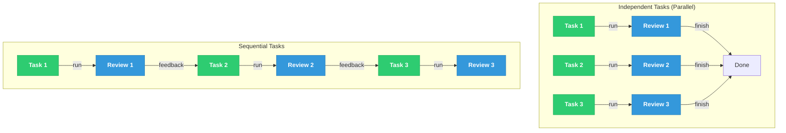
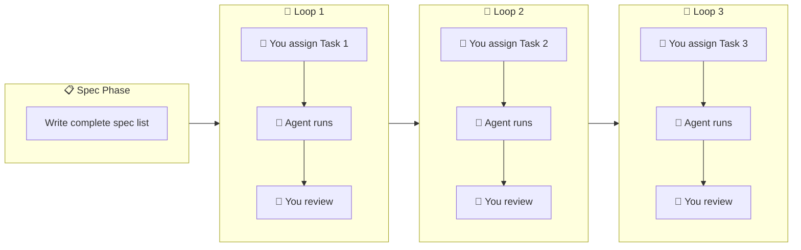
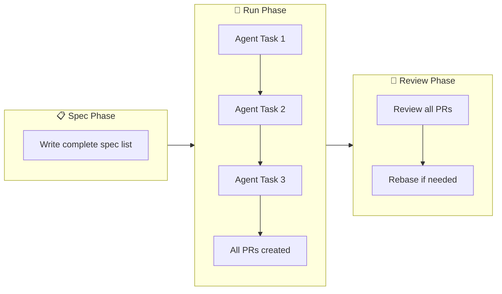

TL;DR: Use stacked PRs to let AI agents work longer without frequent context
switches, balancing productivity gains against review complexity

<!-- more -->

- This is the execution half of
  [My Agentic Engineering Flow](/blog/my-agentic-engineering-flow): once a `tasks.md`
  has passed `/auto_task.criticize`, this post is about which of the two execution
  modes to pick and how each one is implemented under the hood

## The Challenge

- When working with AI agents, two competing goals create tension:
  - **Goal 1**: Let agents run longer on extended task sequences (ideally full-day
    runs)
  - **Goal 2**: Review agent work frequently without losing context or having the
    agent make expensive mistakes
- As humans, we avoid constant context switching and prefer continuous blocks of
  similar work
  - E.g., reviewing five related changes is more productive than alternating between
    running tasks, reviewing, running again, reviewing again

## Understanding Your Workflow

- The right approach to direct agents depends on how tasks relate to each other:
  - **Independent tasks**: Agents run in parallel on separate paths, and you review
    all results when complete
  - **Sequential tasks**: Each task must complete before the next begins, and
    feedback between steps shapes future work, forcing a linear progression

// TODO(ai_gp): Use green for human tasks and blue for agent tasks in the entire file.
// TODO(ai_gp): Rename Task 1 as "Assign Task 1", "Review Task 1"


- Independent tasks run in parallel without affecting each other
  - The problem is that
    - It's difficult to keep track of N independent tasks
    - Often we would rather finish completely one task in 1 day, rather than
      completing $N$ tasks in $N$ days

## Strategy 1: Interactive Workflows

- An interactive workflow runs fast feedback loops:
  - Write all task specifications upfront (single spec session)
  - Assign one task to the agent
  - Review the result
  - Assign the next task based on what you learned
- **Pros**:
  - This approach minimizes divergence: feedback is frequent and specific so the
    agent and the user are in sync
- **Cons**:
  - User has constant context switching between review and dispatch
  - Sometimes user gets stuck waiting for the agent to finish

## Strategy 2: Precompiled Task List

- This approach is still interactive, but the idea is to remove spec-writing time
  from the loop, leaving only: run -> review -> repeat with faster feedback and lower
  cognitive load per cycle

// TODO(ai_gp): Debug why the unicode icons are not rendered by render_images
// TODO(ai_gp): Use green for human tasks and blue for agent tasks in the entire file.


- A variation of the precompiled task list is to let the agent go ahead through the
  task list and commit multiple times
- **Cons**:
  - Reviewing the work becomes difficult since in Git / GitHub the unit of work is
    typically a PR as a group of commits and not a list of commits

## Strategy 3: Stacked PRs

- Stacked PRs reduce interruptions by letting the agent work longer:
  - Write all task specifications once, upfront
  - Agent completes multiple tasks in sequence
  - Agent creates multiple PRs automatically (one per task or logical change)
  - You review all PRs together when the agent finishes
  - All stacked PRs are merged together in sequence
- **Pros**:
  - This creates a single uninterrupted work block for the user and the agent
- **Cons**
  - _Divergence risk grows_: longer task sequences without feedback increase the
    chance the agent misunderstands requirements (or it was poorly specified)
  - _Compound complexity_: later tasks depend on earlier ones, so review becomes
    interconnected
  - _Expensive corrections_: fixing mistakes mid-sequence requires rebasing all
    downstream changes (aka the problem of "stacked PRs")



## When to Use Each Strategy

- **Use interactive workflows** when:
  - Tasks are exploratory or uncertain
  - Feedback shapes future work
  - Costs of divergence are high
- **Use stacked PRs** when:
  - Tasks are well-defined and independent
  - Agent can work with clear, complete specifications
  - You prefer focused review sessions over frequent interruptions
  - Tasks fit a logical sequence (e.g., modular features or refactoring stages)

## Implementing Stacked PRs

- Both examples below implement the same feature split into three sequential tasks:
  - **Task 1**: Add the database schema
  - **Task 2**: Add the API endpoint (depends on Task 1)
  - **Task 3**: Add the UI component (depends on Task 2)

### GitHub Stacked PRs

- GitHub provides native stacked PR support (currently in public preview): a stack is
  a dependency chain of PRs where the bottom PR targets the trunk branch (e.g., `main`)
  and each PR above it targets the branch of the PR below it
  - GitHub shows a stack icon and a stack map on every PR in the chain, and it
    automatically retargets the PR above when the PR below merges
- There are two ways to build a stack: the `gh stack` CLI extension (fastest for an
  agent-driven workflow) or the GitHub web UI (no extension required)

#### Option A: `gh stack` CLI Extension

- One-time setup:

  ```bash
  > gh extension install github/gh-stack
  ```

- Create the stack for our three-task example:

  ```bash
  # Initialize the stack: creates and checks out the first branch off main.
  > gh stack init feature/step-1-schema
  # ... agent adds database schema ...
  > git add -A && git commit -m "Step 1: add database schema"

  # Add the second layer on top of the first.
  > gh stack add feature/step-2-api
  # ... agent adds API endpoint ...
  > git add -A && git commit -m "Step 2: add API endpoint"

  # Add the third layer on top of the second.
  > gh stack add feature/step-3-ui
  # ... agent adds UI component ...
  > git add -A && git commit -m "Step 3: add UI component"

  # Push every branch and create the three linked PRs in one shot.
  > gh stack submit --auto
  ```

- `gh stack submit` pushes all branches and creates one PR per layer with the bases
  wired up automatically: Step 1 targets `main`, Step 2 targets
  `feature/step-1-schema`, and Step 3 targets `feature/step-2-api`
- Check the stack at any time:

  ```bash
  > gh stack view
  ```

- **Updating an earlier PR**: if review feedback lands on Step 1, fix it in place and
  let `gh stack` cascade the rebase instead of rebasing each branch by hand:

  ```bash
  > gh stack checkout feature/step-1-schema
  # ... apply fix ...
  > git add -A && git commit -m "Fix: address review comment"

  # Rebase every branch above Step 1 onto the fixed commit and push.
  > gh stack rebase --upstack
  > gh stack push
  > gh stack top
  ```

- **Merging the stack**: stacks merge bottom-up. Every PR below the one you merge
  must already be approved with passing checks, and the stack must have a linear
  history:

  ```bash
  # Merge only Step 1: Step 2 and Step 3 auto-retarget onto main.
  > gh stack merge feature/step-1-schema --squash

  # Merge Step 1 and Step 2 together, leaving Step 3 open.
  > gh stack merge feature/step-2-api --squash

  # Merge the entire stack at once.
  > gh stack merge --yes --squash
  ```

  - Branch protection rules and required checks are enforced on every PR in the
    stack, not only the bottom one, and stacks work with merge queues

#### Option B: GitHub Web UI (No Extension)

- Create the first PR normally, targeting `main`:

  ```bash
  > git checkout -b feature/step-1-schema main
  # ... agent adds database schema ...
  > git add -A && git commit -m "Step 1: add database schema"
  > git push -u origin feature/step-1-schema
  > gh pr create --base main --head feature/step-1-schema \
      --title "Step 1: add database schema"
  ```

- Create the second PR against the first PR's branch, then click **Create stack** on
  the PR page (GitHub also shows a banner offering this automatically once it detects
  the chained bases):

  ```bash
  > git checkout -b feature/step-2-api feature/step-1-schema
  # ... agent adds API endpoint ...
  > git add -A && git commit -m "Step 2: add API endpoint"
  > git push -u origin feature/step-2-api
  > gh pr create --base feature/step-1-schema --head feature/step-2-api \
      --title "Step 2: add API endpoint"
  ```

- Add the third PR the same way. From here on you can also use the stack icon on any
  PR in the chain and choose **Add to stack**, which points the new PR's base at the
  current top of the stack automatically:

  ```bash
  > git checkout -b feature/step-3-ui feature/step-2-api
  # ... agent adds UI component ...
  > git add -A && git commit -m "Step 3: add UI component"
  > git push -u origin feature/step-3-ui
  > gh pr create --base feature/step-2-api --head feature/step-3-ui \
      --title "Step 3: add UI component"
  ```

- Once linked, GitHub renders the three PRs as a connected stack. Merging
  `feature/step-1-schema` into `main` automatically retargets Step 2's base to `main`

- Refer to
  [GitHub's stacked PRs documentation](https://docs.github.com/en/pull-requests/get-started/about-stacked-prs)
  and the
  [CLI quickstart](https://docs.github.com/en/pull-requests/get-started/stacked-prs-quickstart)
  for full setup and workflow details

### GitHub Stacked PRs + Helpers

- The helpers framework provides several CLI tools to streamline the stacked PR
  workflow:

#### Creating Branches with Issues

- Use `git_create_issue_and_branch.py` to create a GitHub issue and corresponding
  branch simultaneously:

  ```bash
  # Create a new GitHub issue and branch for a feature
  > git_create_issue_and_branch.py \
      --gh_issue_title "Step 1: Add database schema" \
      --create_worktree

  # Or use an existing issue ID to create a branch
  > git_create_issue_and_branch.py \
      --gh_issue_id 123
  ```

- This script:
  - Creates the GitHub issue (or uses an existing one with `--gh_issue_id`)
  - Creates a git branch and PR named after the issue ID (e.g.,
    `IssueId123_Description`)
  - Optionally creates a git worktree for parallel work
  - Handles symmetric branch creation in submodules if present

#### Creating Branches Without Issues

- Use the `invoke git_branch_create` task to create a branch with a simpler workflow:

  ```bash
  # Create a branch directly
  > invoke git_branch_create --name "feature/step-1-schema"

  # Create a branch from an existing GitHub issue
  > invoke git_branch_create --issue-id 123

  # Optionally skip PR creation
  > invoke git_branch_create --name "feature/step-1-schema" --no-create-pr
  ```

#### Linking Helper-Created Branches into a Native Stack

- Once the helpers scripts have created the branch chain (each branch created off the
  previous one, per task), link them into one native GitHub stack without recreating
  anything locally:

  ```bash
  > gh stack link feature/step-1-schema feature/step-2-api feature/step-3-ui
  ```

- This combines the helpers framework's issue tracking and worktree support with
  GitHub's native stack view, bottom-up merge ordering, and automatic PR retargeting

#### Syncing with Master

- After creating your branch stack, use `invoke git_merge_master` to bring in changes
  from master without frequent context switches:

  ```bash
  # Merge master into the current branch
  > invoke git_merge_master

  # Skip automatic push (resolve conflicts manually first)
  > invoke git_merge_master --no-auto-merge
  ```

- This follows the merge-based approach (not rebase) to minimize conflict resolution
  when your branch has accumulated many small commits. See
  [Merge, Rebase, or Squash: Choosing How to Catch Up with Master](/blog/how-to-i-git-merge-master)
  for a deeper explanation of the merge strategy

#### Comparing Branches

- Use `git_branch_diff` to see differences between your branch and a target
- The `--target` options:
  - `base`: diff against your branch point (most useful for seeing what you changed)
  - `master`: diff against `origin/master`
  - `head`: diff only modified files
  - `hash`: diff against a specific commit hash with `--hash-value`
- E.g.,

  ```bash
  # See what changed between your branch and master
  > invoke git_branch_diff --target master

  # See files changed since branching point
  > invoke git_branch_diff --target base

  # Only print file names (useful for scripts)
  > invoke git_branch_diff --target master --only-print-files

  # Filter to specific file types
  > invoke git_branch_diff --target master --file-types py,md
  ```

## Key Takeaways

- **Balance runtime against interruption**: longer agent runs save context switches
  but increase divergence risk
- **Predefine all task specifications**: this is essential for both strategies
- **Stacked PRs work best for predictable sequences**: clear scope reduces surprises
- **Use tooling to manage complexity**: GitHub stacked PRs or `git-spice` handle the
  mechanical details
When in doubt, start with interactive workflows. Use stacked PRs once task sequences
are stable and well-understood
