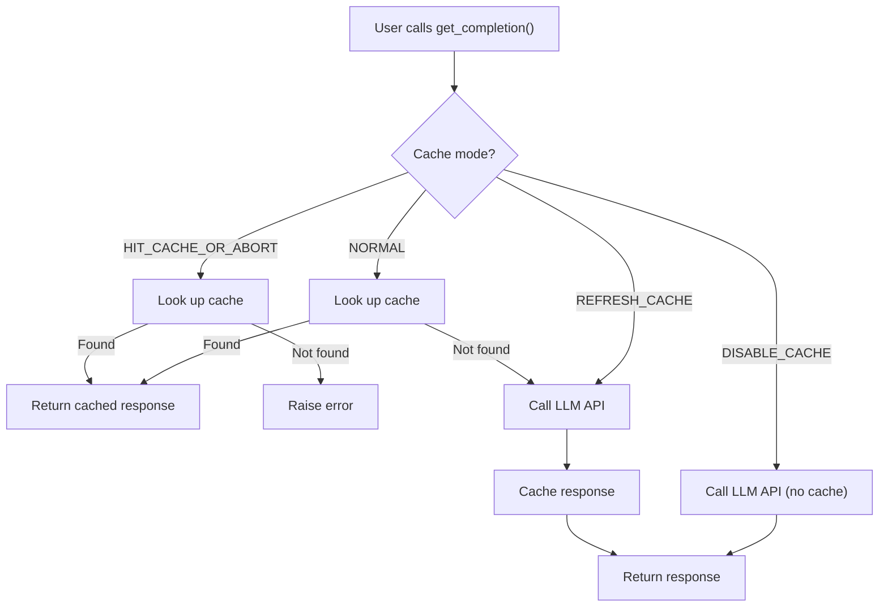
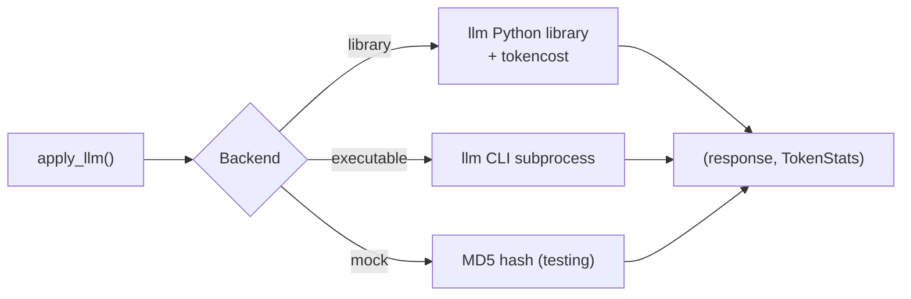

TLDR A Python helper that wraps OpenAI and OpenRouter APIs with built-in
caching, cost tracking, structured outputs, and batch processing for DataFrame
workflows.

<!-- more -->

# Introduction

## What Is `hllm`?

- `hllm` is a helper module that provides a unified interface for calling Large
  Language Models (LLMs) through OpenAI and OpenRouter APIs
- It is part of the `helpers` library, designed to simplify common LLM workflows
  by wrapping the OpenAI Python SDK and the `llm` CLI/library ecosystem
- The module (`helpers/hllm.py`) covers:
    - **Simple completions**: `get_completion()` for text generation
    - **Structured outputs**: `get_structured_completion()` for Pydantic-typed
      responses
    - **Batch DataFrame processing**: `apply_prompt_to_dataframe()` for row-wise
      LLM calls
    - **Cost tracking**: `LLMCostTracker` for accumulating and reporting API
      costs
    - **Caching**: Built-in caching via `hcache_simple` decorators to avoid
      redundant API calls

- A companion module (`helpers/hllm_cli.py`) provides:
    - `apply_llm()`: A unified interface supporting `executable` (CLI),
      `library` (Python), and `mock` backends
    - `apply_llm_batch_individual()`, `apply_llm_batch_with_shared_prompt()`,
      `apply_llm_batch_combined()`: Three batch processing strategies
    - `apply_llm_prompt_to_df()`: Full-featured DataFrame batch processing with
      progress bars and incremental saving
    - `TokenStats`: Structured tracking of token usage and costs
    - CLI argument generators for building LLM-powered scripts

## When To Use `hllm`

- You need to make LLM API calls (OpenAI or OpenRouter) from Python code and
  want a thin, tested wrapper
- You want **structured outputs** (Pydantic models) from the LLM via OpenAI's
  Responses API with `response_format`
- You need to **process a DataFrame column** with the same prompt across many
  rows, tracking cost and progress
- You want **caching** of API responses to avoid repeated calls during
  development or testing
- You need to **track and accumulate costs** across multiple LLM calls
- You are building a script that accepts standard LLM CLI arguments and want
  reusable argument parsing

## When NOT To Use `hllm`

- You need streaming-only responses with complex real-time handling -- use the
  OpenAI SDK directly
- You are working with providers other than OpenAI or OpenRouter (e.g.,
  Anthropic Claude, Google Gemini)
- You need fine-grained control over HTTP client configuration, proxies, or
  retry policies
- Your use case involves only the `llm` CLI tool with no Python integration --
  the standalone `llm` tool may suffice

# How It Works

## Architecture Overview

- The module uses a two-layer design:
    - **User-facing functions** (`get_completion`, `get_structured_completion`)
      handle parameter validation, client creation, and cache mode dispatch
    - **Internal API call functions** (`_call_api_sync`,
      `_call_structured_api_sync`) are decorated with `@hcacsimp.simple_cache`
      for transparent caching

- Cache modes control when API calls happen:
    - `DISABLE_CACHE`: Always call the API, never save to cache
    - `REFRESH_CACHE`: Always call the API and update the cache
    - `HIT_CACHE_OR_ABORT`: Return cached response only, fail if missing
    - `NORMAL`: Return cached response if available, otherwise call API

- Provider selection is inferred from the model string:
    - `gpt-4o-mini` or `openai/gpt-4o-mini` -> OpenAI
    - `deepseek/deepseek-r1-0528-qwen3-8b:free` -> OpenRouter
    - The appropriate API key (`OPENAI_API_KEY` or `OPENROUTER_API_KEY`) is read
      from environment variables



## Structured Outputs

- `get_structured_completion()` uses OpenAI's Responses API with
  `response_format` to return Pydantic model instances
- The parsed output is validated and returned as the specified type, eliminating
  manual parsing of JSON responses
- This is cached separately using pickle-based caching since Pydantic objects
  are not JSON-serializable

## The `hllm_cli` Layer

- `apply_llm()` provides three backends:
    - **`library`**: Calls the `llm` Python library directly, with token cost
      calculation via `tokencost`
    - **`executable`**: Invokes the `llm` CLI tool as a subprocess
    - **`mock`**: Returns an MD5 hash of the input for deterministic testing

- The three batch strategies for `hllm_cli`:
    - **`individual`**: Separate API call per input item (most expensive, most
      isolated)
    - **`shared_prompt`**: Maintains a conversation context across all items
      (efficient for related queries)
    - **`combined`**: Sends all items in a single prompt with JSON output
      instruction (most efficient, requires careful prompt engineering)



## Cost Tracking

- `LLMCostTracker` (`hllm_cost.py`) accumulates costs across multiple API calls
- For OpenAI models, pricing is hardcoded per model (e.g., gpt-4o-mini: $0.15/M
  input tokens, $0.60/M output tokens)
- For OpenRouter models, pricing is fetched from the OpenRouter API and cached
  locally
- `TokenStats` in `hllm_cli.py` provides structured cost breakdown with
  formatted output (dollars, cents, or microdollars)

# Real-World Scenarios

## Scenario 1: Single Prompt with Caching

- A developer iterating on a prompt wants to avoid paying for repeated identical
  API calls
- Using `cache_mode="NORMAL"`, the first call hits the API, and subsequent calls
  with the same parameters return instantly from cache

```python
import helpers.hllm as hllm

response = hllm.get_completion(
    user_prompt="What is the capital of France?",
    system_prompt="You are a geography expert.",
    model="gpt-4o-mini",
    cache_mode="NORMAL",
    temperature=0.1,
)
# First call: API. Second call with same params: cache hit.
print(response)
```

## Scenario 2: Structured Outputs from LLM

- An application needs reliably parsed data from the LLM, not free text
- Using `get_structured_completion()` with a Pydantic model ensures type-safe,
  validated output

```python
from pydantic import BaseModel
import helpers.hllm as hllm

class CityInfo(BaseModel):
    name: str
    country: str
    population_millions: float

result: CityInfo = hllm.get_structured_completion(
    user_prompt="Tell me about Tokyo",
    response_format=CityInfo,
    model="gpt-4o-mini",
    cache_mode="DISABLE_CACHE",
)
print(f"{result.name}, {result.country}: {result.population_millions}M")
```

## Scenario 3: Batch Processing a DataFrame

- A data scientist needs to classify or transform text in a DataFrame column
  using an LLM
- `apply_prompt_to_dataframe()` processes rows in configurable chunks with
  progress bars

```python
import pandas as pd
import helpers.hllm as hllm

df = pd.DataFrame({
    "review": ["Great product!", "Terrible service.", "Okay, not great."]
})

df_result = hllm.apply_prompt_to_dataframe(
    df=df,
    prompt="Classify sentiment as positive, negative, or neutral.",
    model="gpt-4o-mini",
    input_col="review",
    response_col="sentiment",
    chunk_size=50,
)
```

## Scenario 4: CLI Script with LLM Processing

- A developer building an LLM-powered script wants standard argument parsing
- `add_llm_args()` provides `--input`, `--output`, `--prompt`, `--model`,
  `--backend`, and `--progress_bar` arguments

```python
import argparse
import helpers.hllm_cli as hllmcli

parser = argparse.ArgumentParser()
hllmcli.add_llm_args(parser, input_required=True)
args = parser.parse_args()

# Process input through LLM
token_stats = hllmcli.apply_llm_with_files(
    args.input, args.output,
    system_prompt=args.system_prompt,
    model=args.model,
)
```

# Advanced Features

## Testing with Mock Backend

- The `mock` backend in `apply_llm()` returns deterministic MD5 hashes, enabling
  unit tests without API calls
- The `mock_apply_llm()` context manager patches `apply_llm()` globally for
  testing:

```python
import helpers.hllm_cli as hllmcli

with hllmcli.mock_apply_llm():
    response, stats = hllmcli.apply_llm(
        "some input",
        system_prompt="some prompt",
    )
    # response is MD5("some inputsome prompt")
```

## Cache Refreshing for Testing

- Set the global update flag to regenerate cached responses during test runs
- This is used with `pytest --update_llm_cache` to refresh test golden files

## Cost Tracking with LLMCostTracker

- Accumulate costs across multiple `get_completion()` calls by passing a shared
  `cost_tracker` instance
- View accumulated costs at any time with `tracker.get_current_cost()`

## Batch Strategies in `hllm_cli`

- Three strategies with different efficiency profiles:
    - `individual`: N separate calls, independent contexts
    - `shared_prompt`: N calls sharing a conversation history
      (context-efficient)
    - `combined`: 1 call with N items in JSON format (most efficient, requires
      JSON parsing with retries)

## DataFrame Processing with Incremental Saving

- `apply_llm_prompt_to_df()` supports `dump_every_batch` to save intermediate
  results to disk
- If processing crashes, partial results are preserved and skipped on restart

# Comparison with Alternatives

| Tool           | Provider Support   | Caching                  | Structured Outputs         | Batch DF Processing           | CLI Integration |
| :------------- | :----------------- | :----------------------- | :------------------------- | :---------------------------- | :-------------- |
| **`hllm`**     | OpenAI, OpenRouter | Built-in (hcache_simple) | Pydantic via Responses API | `apply_prompt_to_dataframe()` | Via `hllm_cli`  |
| **OpenAI SDK** | OpenAI only        | Manual                   | `response_format` param    | Manual                        | Manual          |
| **`llm` CLI**  | 100+ models        | Manual plugins           | Limited                    | Not built-in                  | Native CLI      |
| **LangChain**  | 50+ providers      | Built-in                 | Via output parsers         | Via `LLMChain`                | Via CLI tools   |
| **Instructor** | Multiple           | Third-party              | First-class                | Manual                        | Manual          |

- `hllm` is best when you want a lightweight, tested wrapper with built-in
  caching and cost tracking, without pulling in large framework dependencies
- For multi-provider support beyond OpenAI/OpenRouter, LangChain or direct SDK
  usage may be more appropriate
- For pure CLI usage without Python, the `llm` tool is a good standalone option

# References

- Source code:
  [`helpers/hllm.py`](https://github.com/causify-ai/helpers/blob/master/helpers/hllm.py)
- CLI module:
  [`helpers/hllm_cli.py`](https://github.com/causify-ai/helpers/blob/master/helpers/hllm_cli.py)
- Cost tracking:
  [`helpers/hllm_cost.py`](https://github.com/causify-ai/helpers/blob/master/helpers/hllm_cost.py)
- Tutorial notebook:
  [`helpers/notebooks/hllm.tutorial.ipynb`](https://github.com/causify-ai/helpers/blob/master/helpers/notebooks/hllm.tutorial.ipynb)
- Example notebook:
  [`tutorials/OpenAI/hllm.example.ipynb`](https://github.com/causify-ai/helpers/blob/master/tutorials/OpenAI/hllm.example.ipynb)
- Explanation docs:
  [`docs/tools/helpers/all.hllm.explanation.md`](https://github.com/causify-ai/helpers/blob/master/docs/tools/helpers/all.hllm.explanation.md)
- Test files:
    - [`helpers/test/test_hllm.py`](https://github.com/causify-ai/helpers/blob/master/helpers/test/test_hllm.py)
    - [`helpers/test/test_hllm_cli.py`](https://github.com/causify-ai/helpers/blob/master/helpers/test/test_hllm_cli.py)
    - [`helpers/test/test_hllm_decorator.py`](https://github.com/causify-ai/helpers/blob/master/helpers/test/test_hllm_decorator.py)
- OpenAI API pricing: <https://openai.com/api/pricing>
- `llm` CLI tool: <https://llm.datasette.io/>
