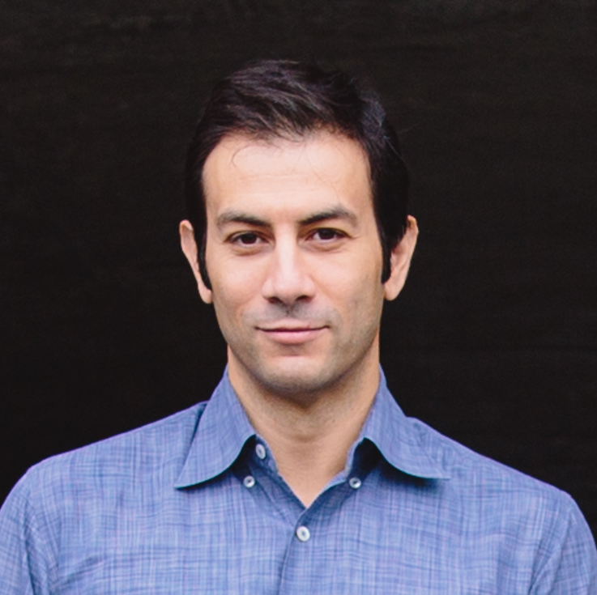
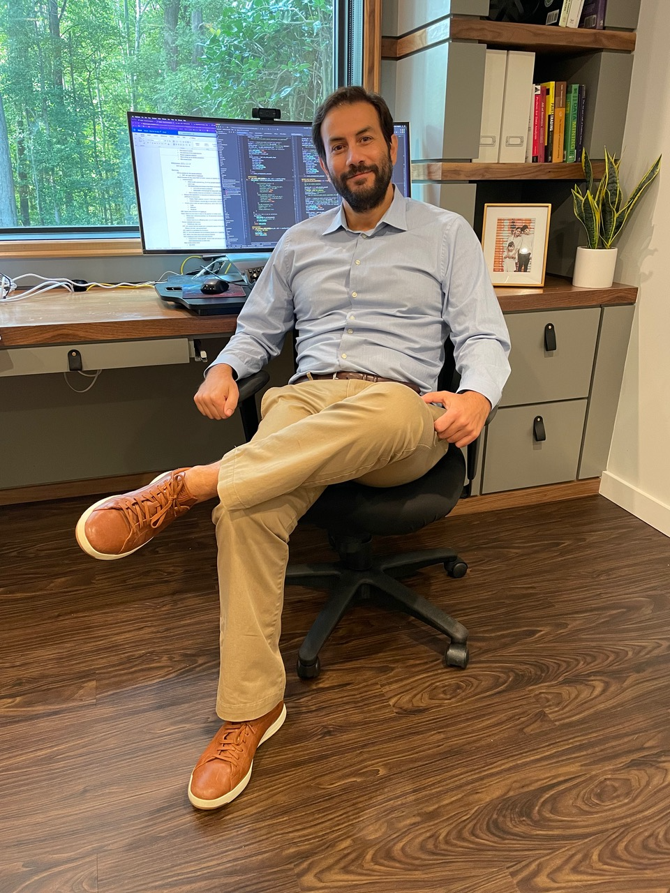

# Giacinto Paolo (GP) Saggese, PhD

- **Co-Founder & CTO** @ [Causify.AI](https://www.causify.ai)
- **3x startup founder**
- **Adjunct Professor**, Computer Science @ University of Maryland, College Park (USA)
- **Industry experiences**
    - _Tech_: NVIDIA, Synopsys, Intel
    - _Finance_: June, Teza, Engineers' Gate
- **Expertise**:
  - Bayesian machine learning, LLMs, reasoning agents
  - 20+ years building AI/ML systems, quant strategies, and high-performance software

- Been writing code almost every day for the last 35 years (see [GitHub
  stats](https://github.com/gpsaggese?tab=activity) for the last few years)

  

    <h3>GP circa 2012</h3>
    
  

  

    <h3>GP circa 2022</h3>
    
  

## Contact Information

- **Email:** gp@causify.ai | gsaggese@umd.edu | saggese@gmail.com
- **LinkedIn:** [linkedin.com/in/gpsaggese](https://linkedin.com/in/gpsaggese)
- **GitHub:** [github.com/gpsaggese](https://github.com/gpsaggese)
- **Location:** Washington DC-Baltimore Area
- **Citizenship:** USA / Italy

## Languages

- **English:** Bilingual proficiency
- **Italian:** Native proficiency
- **Neapolitan:** Bilingual proficiency
    - Neapolitan is Recognized by UNESCO as a distinct language rather than a
      dialect of Italian
    - It is partially intelligible with Italian; linguistic studies suggest that,
      in some respects, Neapolitan is closer to Spanish than standard Italian
- **Latin and Ancient Greek:** Five years of classical studies, including
  competitive translation and interpretation during the 1990s (yes, there is
  such a thing as competitive Latin)
