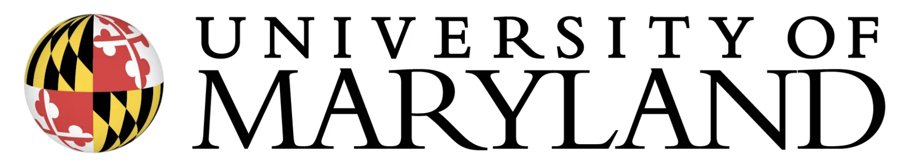
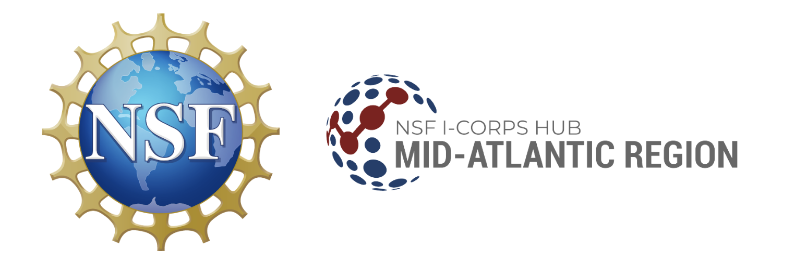

## DATA605: Big Data Systems
{ width="150" }

**Graduate-level course covering distributed computing, big data technologies,
and scalable system design.**

Big Data Systems explores the architecture, implementation, and application of
large-scale distributed systems. Students learn to design and build systems that
process massive datasets using modern big data technologies including Hadoop,
Spark, NoSQL databases, and cloud computing platforms.

**Course Materials:**

- [Syllabus](https://docs.google.com/document/d/e/2PACX-1vTJsW8-7lHiXsdjhAWVgXLAWJWrlnfwG4hd-WQp1s8z-SRSD-K1fBOBkYItg0HCSwJkUx35i-VPbiwo/pub)
- [FAQ](https://docs.google.com/document/d/e/2PACX-1vRw3ZzwbUhx5FEW2_cs4WvS36NPOGKeXWxdwzGhyPJyRAbfXH6eFWbQhAqYUes-QIobGlD-IQuNMfYW/pub)
- [Class GitHub](https://github.com/gpsaggese-org/umd_classes/tree/master/data605)
- [Lectures](https://github.com/gpsaggese-org/umd_classes/tree/master/data605/lectures)
- [ELMS](https://umd.instructure.com/courses/1342334)

**Past Offerings:**

- [Spring 2024](https://app.testudo.umd.edu/soc/202401/DATA/DATA605)
- [Spring 2023](https://app.testudo.umd.edu/soc/202301/DATA/DATA605)

## MSML610: Advanced Machine Learning
{ width="150" }

**Graduate-level course covering advanced ML techniques, deep learning, and
production ML systems.**

Advanced Machine Learning delves into cutting-edge machine learning methods
including deep learning architectures, reinforcement learning, generative models,
and MLOps. Students gain hands-on experience with modern ML frameworks and learn
to deploy production-grade machine learning systems.

**Course Materials:**

- [Class Schedule](https://docs.google.com/document/d/e/2PACX-1vTfxdfGXcGjuujw1FaWxAL1dXeA95VBqjZ16VAa6UoG8CdGR5-Y4Y08PUQPtH2WvQ9SLNBijw2-vhjB/pub)
- [Class GitHub](https://github.com/gpsaggese-org/umd_classes/tree/master/msml610)
- [Lectures](https://github.com/gpsaggese-org/umd_classes/tree/master/msml610/lectures)
- [ELMS](https://umd.instructure.com/courses/1391619)

## NSF I-Corps: Instructor of Entrepreneurship
{ width="150" }

Teaching entrepreneurship and customer discovery to research teams
commercializing university innovations through the National Science Foundation
Innovation Corps program.

**Program Website:** [icorps.umd.edu](https://www.icorps.umd.edu/)

**Focus Areas:**

- Customer discovery and validation
- Business model development
- Technology commercialization
- Lean startup methodology
- Pitching and fundraising strategies
